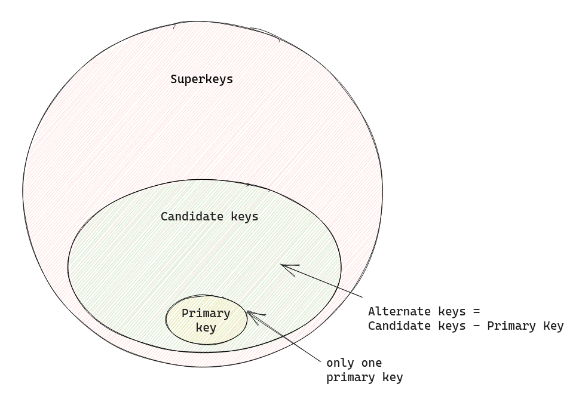

# Relational Algebra

- **Relation** is a **table**, lets call it $R$
- Relation has some **Attributes**(columns)
- From attributes you can make sets - **attribute sets**
    - $A_1, A_2, ..., A_n$ - are attributes
    - $\{A_1, A_2, ..., A_n\}$ - a attribute set
    - $\{A_1, A_2\}$ - another attribute set
- Tuples - $t$
    - a row or relation $R$

## Keys

- Superkey
    - A superkey is a **set of one or more attributes** (columns) that can uniquely identify a record within a table.
    - It may contain extra attributes that are not necessary for uniqueness.
    - If $K$ is a superkey then, $K[t_1] \neq K[t_2]$
- Candidate key
    - A candidate key is a minimal superkey, meaning it is a subset of a superkey that can uniquely identify each record within a table.
    - It does not contain any unnecessary attributes.
    - A table may have multiple candidate keys.
- Primary key
    - A primary key is a specific candidate key chosen as the main identifier for each record in a table.
    - It must be unique and non-null for every record, and there can be only one primary key per table.
- Alternate key
    - An alternative key is a candidate key that is not selected as the primary key.
    - While it may not be the primary identifier, it still uniquely identifies each record in the table.

## Functional Dependencies

- Choose two attribute sets
    - $X = \{A_{1}^{'}, A_{2}^{'}, ..., A_{n}^{'}\}$
    - $Y = \{A_{1}^{''}, A_{2}^{''}, ..., A_{m}^{''}\}$
- Choose **two arbitrary tuples** - $t_1, t_2$ in $R$
- If $t_1.X = t_2.X$ implies $t_1.Y = t_2.Y$, for all $t_1, t_2$ of $R$, then there is a **functional dependency** from
  $X$ to $Y$ and it is represented as $X \rightarrow Y$

### Trivial FD

- $X \rightarrow Y$ is trivial if $X \subseteq Y$

### Non-trivial FD

- $X \rightarrow Y$ or $XY \rightarrow Z$, here $XY = X \cup Y$

### Closure of set Functional Dependencies

- **Set of functional dependencies** $F$, example $F = \{ X \rightarrow Y, AY \rightarrow Z\}$
- Closure of $F$ ($F^+$) is a set which have all functional dependencies of $F$ and the one which can be **inferred** from $F$.
- For inference we can use following rules:
    - reflexive - $Y \subseteq X$ then $X \rightarrow Y$
    - augmentation - if $X \rightarrow Y$ then $XZ \rightarrow YZ$
    - transitivity - if $X \rightarrow Y$ and $Y \rightarrow X$ then $X \rightarrow Z$
    - decomposition - if $X \rightarrow YZ$ then $X \rightarrow Y$ and $X \rightarrow Z$
    - union - if $X \rightarrow Y$ and $X \rightarrow Z$ then $X \rightarrow YZ$

### Closure of attributes sets

Closure of a set of attributes $X$ with respect to set of functional dependencies $F$ is the set $X+$ of all attributes that are functionally determined by $X$ using $F+$.

- Given some FD set $F$ and attribute sets $A$ and $B$ attribute closure of $(AB)^+ = A^+ \cup B^+$

## Equivalence of sets of FD

- Two sets of FD are equivalent if there closure is same
- intuitively this means that if they can both infer same things

---

- **minimal cover of a FD set**
- or canonical cover
- set of FD - $F$ is minimal cover, if you remove any FD from it it is not equivalent to $F$
- i.e. $F - {X \rightarrow Y}$ is not equivalent to $F$
- this also means that $F$ will have minimum no of FD
- there can be more than one minimal cover of FD of set.

---

## Normalization

- reducing redundancy

- 1NF
- 2NF
- 3NF
- BCNF -> generalize -> 4NF

---

From now on

- $R$ - relation, a table
- $F$ - set of functional dependencies for $R$
- $A$ - attribute set of $R$
- $A_p$ - prime attribute set, which are or can be part of primary key of $R$
- $A_{np} - non prime attribute set$

---

- 1NF
- only atomic values in attributes
- no sets or list of values in attributes

---

- 2NF
- every element of $A_{np}$ is
    - fully functionally dependent on primary key of $R$
    - i.e.
    - not partially dependent on any key of $R$

- what is fully functional dependent
    - a FD $X \rightarrow Y$ is full FD if
    - on removing any attribute from $X$ the FD doesn't hold

---

- 3NF
- every element of $A_{np}$
    - is not transitively dependent on primary key
- for every non trivial FD $X \rightarrow Y$ either
    - $X$ is superkey of $R$ or
    - $Y$ belongs to $A_{p}$

---

- BCNF
- for every non trivial FD $X \rightarrow Y$, $X$ is superkey of $R$
