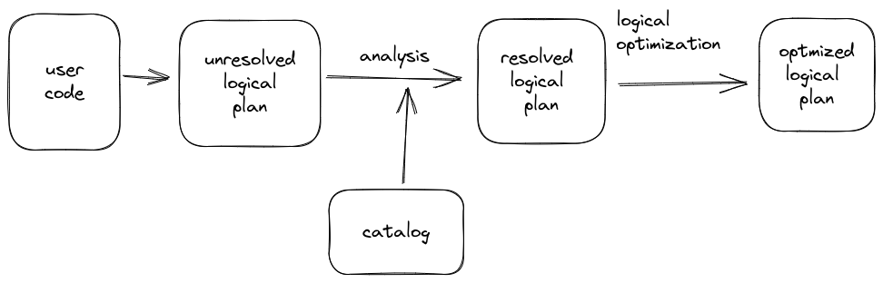
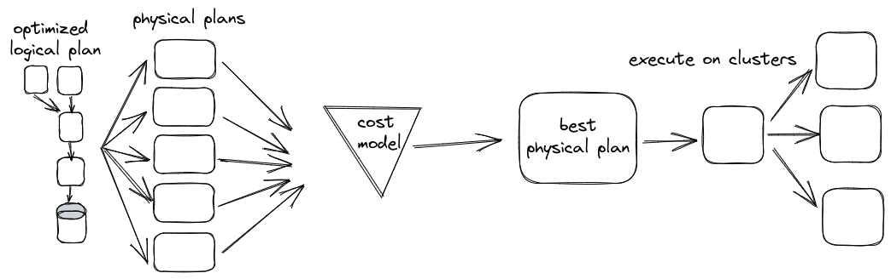

# Structured API Execution

Overview:

1. Write `DataFrame`/`Dataset`/`SQL Code`.
2. If valid code, Spark converts this to a Logical Plan.
3. Spark transforms this Logical Plan to a Physical Plan, checking for optimizations along the way.
4. Spark then executes this Physical Plan (RDD manipulations) on the cluster.

## Logical Planning

- The logical plan only represents a set of abstract transformations that do not refer to executors or drivers, it’s purely to convert the user’s set of expressions into the most optimized version.
- It does this by converting user code into an unresolved logical plan.
- This plan is unresolved because although your code might be valid, the tables or columns that it refers to might or might not exist.
- Spark uses the catalog, a repository of all table and DataFrame information, to resolve columns and tables in the analyzer.
- The analyzer might reject the unresolved logical plan if the required table or column name does not exist in the catalog.
- If the analyzer can resolve it, the result is passed through the Catalyst Optimizer, a collection of rules that attempt to optimize the logical plan by pushing down predicates or selections.
- Packages can extend the Catalyst to include their own rules for domain-specific optimizations.

## Physical Planning

- After successfully creating an optimized logical plan, Spark then begins the physical planning process.
- The physical plan, often called a Spark plan, specifies how the logical plan will execute on the cluster by generating different physical execution strategies and comparing them through a cost model.
- Physical planning results in a series of RDDs and transformations.
- This result is why you might have heard Spark referred to as a compiler—it takes queries in DataFrames, Datasets, and SQL and compiles them into RDD transformations.

> NOTE: An example of the cost comparison might be choosing how to perform a given join by looking at the physical attributes of a given table (how big the table is or how big its partitions are).

## Execution

- Upon selecting a physical plan, Spark runs all of this code over RDDs, the lower-level programming interface of Spark.
- Spark performs further optimizations at runtime, generating native Java bytecode that can remove entire tasks or stages during execution.
- Finally, the result is returned to the user.