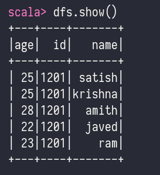
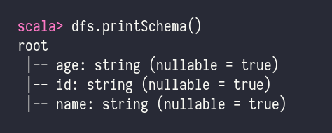
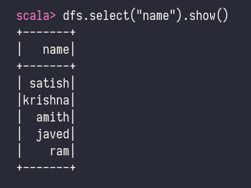
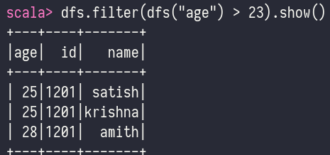

# Data Frames

- A DataFrame is a distributed collection of data, which is organized into named columns.
- Conceptually, it is equivalent to relational tables with good optimization techniques.
- A DataFrame can be constructed from an array of different sources such as
  Hive tables, Structured Data files, external databases, or existing RDDs.

- A DataFrame is the most common Structured API and simply represents a table of data with rows and columns.
- This list that defines the columns and the types within those columns is called schema.
- The reason to distribute data is
    - the data is too large to fit on one machine
    - it will take long time to perform that computation on one machine

## Features of data frame

- Ability to process the data in the size of Kilobytes to Petabytes on a single node cluster to large cluster.
- Supports different data formats (Avro, csv, elastic search, and Cassandra) and storage systems (HOFS, HIVE tables, mysql, etc).
- State of art optimization and code generation through the Spark SQL Catalyst optimizer (tree transformation framework).
- Can be easily integrated with all Big Data tools and frameworks via Spark-Core.
- Provides API for Python, Java, Scala, and R Programming.

## SQLContext

- `SQLContext` is a class and is used for initializing the functionalities of Spark SQL.
- `SparkContext` class object (`sc`) is required for initializing SALContext class object.
- The following command is used for initializing the SparkContext through spark-shell.
	- `spark-shell`
- By default, the SparkContext object is initialized with the name `sc` when the spark-shell starts.
- Use the following command to create `SQLContext`.
	- `scala> val sqlcontext = new org.apache.spark.sql.SQLContext(sc)`

## Sample Operations on a DataFrame

`employee.json` - note that records are separated by line (it is not a normal json file)

```json
{"id": "1201", "name": "satish", "age": "25"}
{"id": "1201", "name": "krishna", "age": "25"}
{"id": "1201", "name": "amith", "age": "28"}
{"id": "1201", "name": "javed", "age": "22"}
{"id": "1201", "name": "ram", "age": "23"}
```

### Read the JSON Document

- First, we have to read the JSON document. Based on this, generate a DataFrame named (dfs).
- Use the following command to read the JSON document named employee,json.
- The data is shown as a table with the fields ~ id, name, and age.
- `scala> val dfs = sqlcontext.read.json("employee.json")`
- Output - The field names are taken automatically from employee.json.`
	- `dfs: org.apache.spark.sql.DataFrame = [age: string, id: string, name: string]`
-   

### Show the Data

- If you want to see the data in the DataFrame, then use the following command.
- `scala> dfs.show()`
- Output - You can see the employee data in a tabular format.
-   

### Show Schema

- `scala> dfs.printSchema()`
-   

### `select()` method

- `dfs.select("name").show()`
-   

### `filter()` method

- `dfs.filter(dfs("age") > 23).show()`
-   

### `groupby()` method

- `dfs.groupBy("age").count().show()`
-   

```scala
spark-shell // will create a sc variable itself
val sqlcontext = new org.apache.spark.sql.SQLContext(sc)

val dfs = sqlcontext.read.json("employee.json")

df.show()
dfs.printSchema()
dfs.select("name").show()
dfs.filter(dfs("age") > 23).show()
dfs.groupBy("age").count().show()
```

## Partitions

- To allow every executor to perform work in parallel, Spark breaks up the data into chunks called partitions.
- A partition is a collection of rows that sit on one physical machine in your cluster.
- A DataFrame's partitions represent how the data is physically distributed across the cluster of machines during execution.
- lf you have one partition, Spark will have a parallelism of only one, even if you have thousands of executors.
- If you have many partitions but only one executors, Spark will still have a parallelism of only one because there is only one computation resource.

## Schema

- Implicit - created when you import the data
- Explicit

```scala
import org.apache.spark.sql.types.{StructField, StructType, LongType, StringType}

// will return org.apache.spark.sql.types.StructType object
val my_manual_schema = StructType(Array( 
				StructField("COUNTRY", StringType, true), 
				StructField("NAME", StringType, true), 
				StructField("count", LongType, false)
))
```

## Columns

- explilict columns creation:
```scala
import org.apache.spark.sql.functions.{col, column}

// will return org.apache.spark.sql.Column object
col("someColumnName")
column("someColumnName")
```

## Rows

- create rows
```scala
import org.apache.spark.sql.Row
val myrow = Row("hello", 1, null, False)

// get values
val name = myrow.getString(0)
val no = myrow.getInt(1)
val temp = myrow(0) // type Any
```

## Transformations

- core data structure is immutable, meaning they cannot be changed after they're created
- to use data it is transformed
- two types of transforamtions
	- those that specify narrow dependencies
	- those that sepecify wide dependencies

- we can
	- add rows or columns
	- remove rows or columns
	- transform row into a column (vice versa)
	- chage order of rows based on the values in columns

## Dataframe Creation

- using csv
```scala
val df = spark.read.format('csv').option("header", "true").option("inferSchema", "true").load('data.csv')
df.printSchema()
df.createOrReplaceTempView("dfTable")
```

## Boolean filters

```scala
df.where(col("inoviceNo").equals(2342)).select("inoviceNo", "description").show(5, false)
```

## Math 

```scala
import org.apache.spark.sql.functions.{expr, pow}

val fabricateQuantity = pow(col("quantity") * col("UnitPrice"), 2) + 5
df.select(expr("customerId"), fabricatedQuantity.alias("realQuantity")).show(2)
```

## Columns Statistics Summary

```scala
df.describe().show()
```

