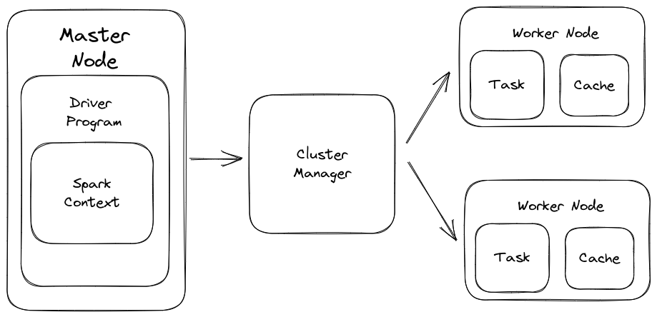

## Spark Architecture

- layered architecture
    - all spark components are loosely coupled
- based on two main abstractions
    - Resilient Distributed Dataset (RDD)
    - Directed Acyclic Graph (DAG)

## RDD - Resilent Distributed Dataset

- building block of spark applications
- Resilient - fault tolerance and is capable of rebuilding on failure
- Distributed - distributed data among the multiple nodes in cluster
- Dataset - Collection of partitioned data with values
- it is a layer of abstracted data over the distributed collection.
- it is immutable in nature and follow lazy transformations.
- immutability means that the state can't be modified later on,  transformation is possible

## Working of Spark Architecture

### master node

- driver program
- if using interactive shell it behaves as driver program
- spark context - the first thing you create inside driver program
    - gateway to all spark functionalities
    - similar to database connection, any command you execute in your database goes through the database connection, likewise anything you do on spark goes through spark context

### cluster manager

- spark context works with cluster manager to manage various jobs
- the driver program and spark context takes care of the job execution within the cluster.
- a job is split into multiple tasks which is distributed over the worker node.
- anytime a RDD is created in Spark context,
	- it can be distributed over the various nodes and can be cached there

### worker nodes

- are slave nodes whose jobs is to execute the tasks
- these tasks are them executed on the partitioned RDDs in the worker node and hence return the result back to the Spark Content.

- spark context take the job and breaks the job in task and distribute them to the worker nodes
- these tasks work on the partitioned RDD, performs operations, collect these results and return to the main Spark Context
- if you increase the number of workers, then you can divide jobs into more partitions and execute them parallely over multiple multiple systems. it will be a lot faster
- with the increase in the number of workers, memory size will also increase and you can cache the jobs to execute it faster