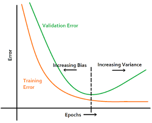
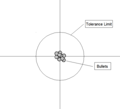
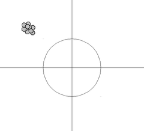
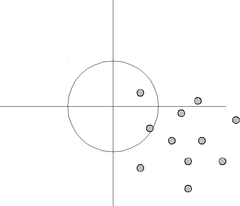
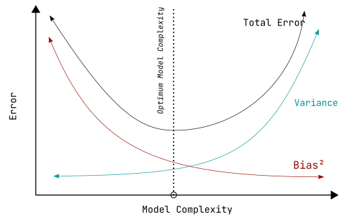

# Supervised Learning

- dataset - labelled, $x_i$ data, $y_i$ corresponding label
- notation
    - $N$ data points, e.g. a person dataset
    $$
    \{(x_i, y_i)\}^N_{i=1}
    $$
    - $x_i$ - ith dataset, e.g. person
    - $x_i^{(j)}$ - ith dataset, jth feature, e.g. a person height
        - $x_i^{(1)}$ - first feature
        - $x_i^{(2)}$ - second feature
- $y_i$ - label, target variable
    - can be either an element belonging to a finite set of classes $\{1,2,\dots, c\}$
    - or a real number
    - or a more complex structure  like vector
    - example for a email message problem
        - $\{\text{spam}, \text{not-spam}\}$
- supervised learning
    - using dataset to produce a model that takes feature $x$ as input and
      output information that allows deducing the label of the feature vector.

## Training

- Historical data - $D = \{(\textbf{X}_1, Y_1), (\textbf{X}_2, Y_2), \dots (\textbf{X}_n, Y_n)\}$ passed to
- Learning Algorithm which outputs a
- model $F$

## Prediction

- Input data $\textbf{X} = \{\text{URL}, \text{Title - Body}, \text{Hyperlink} \}$
- Model - $F(\textbf{X}$)
- Target Label $Y$ for ecommerce site.

- Identify problem, collection of data, and extract features
- Model the mapping form input to output variables.

## Types of supervision

- Classification
    - $Y$ is categorical
    - e.g. web page classification for a search engine, product classification into categories
    - model $F$
        - logistic regression,
        - decision trees,
        - random forest,
        - SVM,
        - naive bayes
- Regression
    - $Y$ is numeric
    - e.g. - base price markup prediction for a product, forecasting demand for a product
    - model $F$
        - linear regression
        - regression trees
        - kernel regression

## Supervised Learning models

- Linear Models
    - linear regression
    - logistic regression
    - SVM
- Tree based models
    - decision tress
    - random forest
    - gradient boosting
- Neural Networks
    - ANN
    - CNN
- Other models
    - k-nearest neighbors
    - naive bayesian
    - bayesian models

## Loss Function

- find good model
- select $F$ minimizing loss function $L$ on the training data $D$

$$
F^* = \argmin_F\left(\sum_{i \in D} L(Y_i, F(\textbf{X}_i)\right)
$$

### Possible loss functions

- squared loss
  $$
  (y-F(\textbf{X}))^2
  $$
- logistic loss
  $$
  \log(1+e^{-yF(\textbf{X})})
  $$
    - $y \in \{+1, -1\}$
    - used in logistic regression
- hinge loss
  $$
  \max(0, 1-yF(\textbf{X})), y \in \{+1, -1\}
  $$
    - $y \in \{+1, -1\}$
    - used in SVM

## Linear Models

$$
F(\textbf{X}) = \textbf{w} \cdot \textbf{X}
$$

- training learns weights $\textbf{w}$ that minimize loss

$$
F^* = \argmin_F \sum_{i \in D} L(Y_i, \textbf{w} \cdot \textbf{X}_i)
$$

### Prediction

- regression
    - $Y = \textbf{w} \cdot \textbf{X}$
- classification
    - $\textbf{w} \cdot \textbf{X} > \text{threshold} \implies Y = +1$
    - $\textbf{w} \cdot \textbf{X} < \text{threshold} \implies Y = -1$

## Overfitting

- Model fits training data well, low training error
- don't generalize well to the unseen data
- complex models with large numbers of parameters capture not only good patterns
  but also bad patterns of noise.

## Under fitting

- model lack the expressive powers, poor training error
- does not capture target distribution - poor test error
- simple linear distribution cannot capture target distribution

## Linear Models

### Regularization

- prevents overfitting by penalizing large weights

$$
F^* = \argmin_F \left(
    \sum_{i \in D} L(
        Y_i,
        F(\textbf{X}_i \cdot \textbf{w}) +
        \lambda \Omega(\textbf{w}))
\right)
$$

- $\lambda$ is the hyperparameter to control
- in $L_1$ regularization
    - $\Omega(\textbf{w}) = \|\textbf{w}\|$
    - $\Omega(\textbf{w}) = w_1 + w_2 + \dots + w_n$
    - sum of all weights of the values in $\textbf{w}$

## Bias Variance Tradeoff

- Suppose we have a large dataset $D$
- We divide this dataset into smaller datasets, $D_1, D_2, \dots, D_n$
- Now we train models on these datasets, $F_1, F_2, \dots, F_n$
- Now we provide a input to these models, $\textbf{X}$
- and get the predictions, $y_1, y_2, \dots, y_n$,
- and the actual value of the prediction should be $y$

Now,

- values $y_1, y_2, \dots, y_n$
    - can be close to each other - low variance in model
    - far apart from each other - high variance in model
- values $y_1, y_2, \dots, y_n$
    - can be close to $y$ - low bias in model
    - can be far from $y$ - high bias in model

 *        | low variance      | high variance
----------|-------------------|--------------
low  bias |  | 
high bias |  | 

