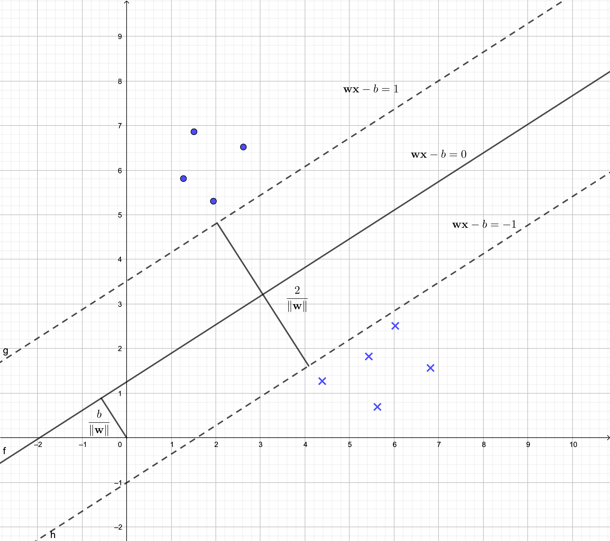

# Unsupervised Learning

- dataset $\{x_i\}^N_{i=1}$
    - unlabelled
    - feature vectors only
- goal is to crete a algorithm that takes feature $x$ as input and either
  transforms it into another vector or into a  value that can be used to
  solve practical problems
- e.g.
    - clustering - model returns the id of cluster
    - dimensionality reduction - feature vector from the input $x$
    - outlier detection - real no $v$ that indicates how $x$ is different from a typical example

## SVM - support vector machine

- hyperplane - defined by two parameter
    - $\textbf{x}$ - input feature vector
    - $\textbf{w}$ - a real valued vector
    - $b$ - a real number
    - $$
      \textbf{w} \cdot \textbf{x} - b = 0
      $$

- Decision boundary
    - the boundary separating the examples of different classes is called decision boundary.

    $$
    y = \operatorname{sign}(\textbf{w} \cdot \textbf{x} - b)
    $$

- the goal of the learning algorithm (SVM) is to leverage the dataset and
    - find the optimal values of $\textbf{w}^*$ and $b^*$ for $\textbf{w}$ and $b$
    - these values are found using optimizing algorithms
    - optimization problem
        - $\textbf{w} \textbf{x}_i - b \ge 1$, if $y_i = +1$
        - $\textbf{w} \textbf{x}_i - b \le -1$ if $y_i = -1$

- finally the model is

$$
f(\textbf{x}) = \operatorname{sign}(\textbf{w}^* - b^*)
$$
