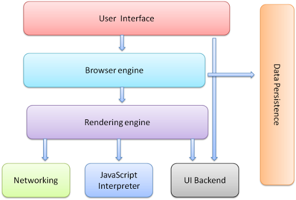

# Browser Structure

## The browser's high level structure

- The user interface
    - this includes the address bar, back/forward button, bookmarking menu etc.
    - Every part of the browser display except the main window where you see the requested page.
- The browser engine
    - the interface for querying and manipulating the rendering engine.
- The rendering engine
    - responsible for displaying the requested content.
    - For example if the requested content is HTML, it is responsible for
       parsing the HTML and CSS and displaying the parsed content on the screen.
- Networking
    - used for network calls, like HTTP requests.
    - It has platform independent interface and underneath implementations for each platform.
- UI backend
    - used for drawing basic widgets like combo boxes and windows.
    - It exposes a generic interface that is not platform specific.
    - Underneath it uses the operating system user interface methods.
- JavaScript interpreter.
    - Used to parse and execute the JavaScript code.
- Data storage.
    - This is a persistence layer.
    - The browser needs to save all sorts of data on the hard disk, for examples, cookies.
    - The new HTML specification (HTML5) defines 'web database' which is a complete
      (although light) database in the browser.

  

### Browser Engine (Layout Engines or Rendering Engine)

<https://en.wikipedia.org/wiki/Browser_engine>

Primary job is to transform HTML documents and other resource of a web page into an interactive
visual representation on a user'a device.

- Gecko - developed by Mozilla Foundation
- Trident - Microsoft, Internet Explorer used this
- KHTML - developed by the KDE project
    - WebKit - fork of KHTML by Apple
        - Blink - WebKit WebCore fork by Google

- <https://en.wikipedia.org/wiki/Comparison_of_browser_engines>
- <https://en.wikipedia.org/wiki/List_of_augmented_browsing_software>
