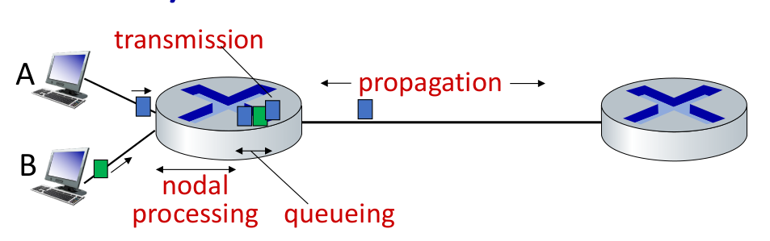
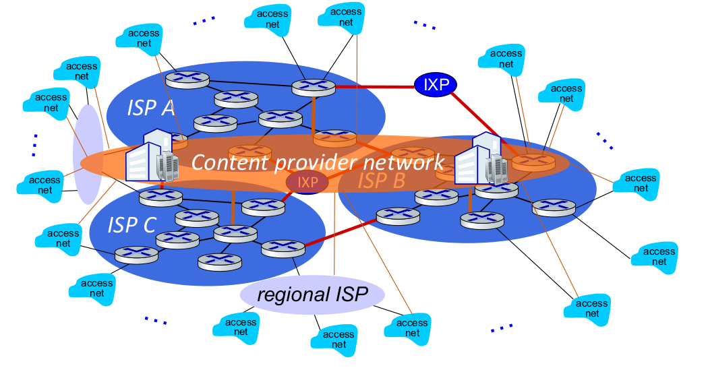
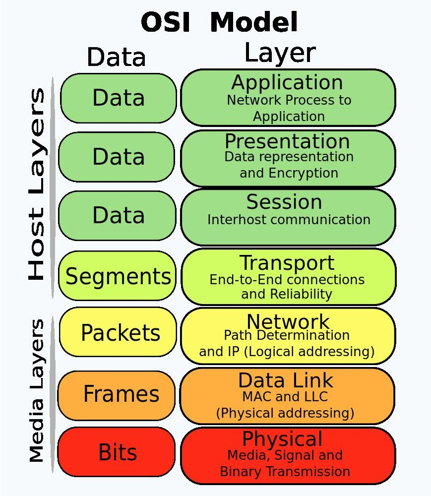

# Networking

## Internet

### nut bolt view

- billions of connected devices
    - hosts - endpoints
- packet switches
    - forward packets
    - routers, switches
- communication links
    - fibre, copper, radio satellite
    - transmission rate - bandwidth
- networks
    - collection of devices, routers, link
    managed by organization
- internet - networks of networks
    - interconnected ISP's
- protocols are everywhere
    - controls sending and receiving of messages
- internet standards
    - **IETF** - Internet engineering task force
        - develops and promotes voluntary Internet standards,
      in particular the technical standards that comprise
      the Internet protocol suite
    - **RFC** - Request for comments, produced by IETF

### services view

- infrastructure that provides services to applications
- provides programming interfaces to distributed application

## Protocols

Protocols define the

- format
- order of messages sent and received among network entities
- and actions taken on message transmission,
- receipt

## Internet structure

- network edge
    - hosts - clients
    - servers - in data centers
- access network, physical media
    - wired, wireless communication links
- network core
    - interconnected routers
    - network of networks

### Host: sends packet of data

- host sending function
    - take application messages
    - breaks it into small chunks, known as packets of length $L$ bits
    - transmits packets into access network at transmission rate $R$

- same things:
    - network transmission rate
    - link transmission rate
    - link capacity
    - link bandwidth

- packet transmission delay $d_t$
    - time needed to transmit $L$ bit packet into link
  
$$
d_t = \frac{L}{R} \frac{(\text{bit})}{(\text{bit/s})}
$$

### Links - physical media

- **bit** - propagates between transmitter-receiver pair
- **physical link** - what lies between transmitter and receiver

---

- **guided media** - signal propagates in solid medium
- **unguided media** - signal propagates freely

#### guided media

- twisted pair (TP)
    - two insulated copper wire
    - category 5 - 100 Mbps - 1Gbps Ethernet
    - category 6 - 100 Gbps Ethernet
- coaxial cable
    - bidirectional
    - broadband
        - multiple frequency channels on cable
        - 100 Mbps per channel
- fibre optic cable
    - 10-100 Gbps

#### unguided media

- wireless radio
    - wireless LAN wifi
    - wide area - 4g
    - bluetooth
    - terrestrial microwave
    - satellite

### Network core

- packet switching and circuit switching

#### Circuit switching

- end to end resources allocated to, reserve for a call between source and
  destination
- dedicated resources - no sharing
- circuit segment is idle if not used by the call
- was used in telephone networks

##### Multiplexing

Multiplexing is a technique used to combine and send the
multiple data streams over a single medium. The
transmission medium is used to send the signal from sender
to receiver. The medium can only have one signal at a time.
When multiple signals share the common medium, there is a
possibility of collision. Multiplexing concept is used to avoid
such collisions.

- frequency division multiplexing (FDM)
    - electromagnetic frequencies - divided into narrow bands
    - each user gets its own band
- time division multiplexing (TDM)
    - time divided into sots
    - each call is allocated periodic slot

#### Packet switching

- host breaks application layer messages into packets
- network forward packets form one router to another
- across links from source to destination
- two key networks core functions
    - forwarding/switching - local action
    - routing - global action

---

- store and forward
    - packet transmission delay $L/R$ seconds
        - to transmit a $L$ bit packet into a link at $R$ bps
    - store and forward
        - entire packet must arrive to router before it can be transmitted

---

- queuing
    - occurs because packet arrives faster than they can be transmitted
    - if arrival rate exceeds the transmission rate queuing will occur
    - packets will be in queue, waiting to be transmitted on output link
    - packets can be dropped or if memory (buffer) in router fills up

##### how packet delay and loss occur

- packet queue in router buffer, waiting for their turn in transmission
- packet loss occurs when memory to hold queued packet fills up

##### delay sources

$$
d_{nodal} = d_{proc} + d_{queue} + d_{trans} + d_{prop}
$$

- $d_{proc}$ - nodal processing delay
    - check bit errors
    - determine output link
    - typically less than microsecond

---

- $d_{queue}$ - queueing delay
    - time wasting at output link for transmission
    - depends on congestion level of the router
    - $a$ - average packet arrival rate in bits per sec
    - $L$ - packet size in bit
    - $R$ - transmission rate in bits per sec
    - traffic intensity = $La/R$
        - ~ 0 - small queuing delay
        - -> 1 - large queuing delay
        - \> 1 - inf queuing delay

---

- $d_{tarns}$ - transmission delay
    - $L$ - packet size in bit
    - $R$ - transmission rate in bits per sec
    - $d_{trans} = L/R$

---

- $d_{prop}$ - propagation delay
    - $d$ - length of the physical link
    - $s$ - propagation speed
    - $d_{prop} = d/s$

---

- **transmission delay** is the amount of time required to push all the packet's bits into the wire
- **queuing delay** is delays encountered by a packet between the time of insertion
  into the network and the time of delivery to the address
- **processing delay** is the time it takes routers to process the packet header
- **propagation delay** is the time duration taken for a signal to reach its destination.

##### throughput

- rate - bits per second - at which data is being send form transmitter to receiver
    - instantaneous - at given point
    - average - rate over longer period of time

### How is it connected

- host connected to
    - access isp connected to
        - regional isp
            - content provider network link google
        - global isp connected by
            - ixp - internet exchange point

### topology it defines how the network is connected

- bus topology
- star topology - this is most common now
- ring topology
- mesh topology

## Protocol, layers, service models

### why layering

- to design complex systems
- explicit structure allows identification,
  relationship of system pieces
- modularization eases maintenance and updating the system

### layered protocol stack

- **application**
- **presentation**
- **session**
- **transport**
- **network**
- **data link**
- **physical**

### OSI Model

- developed by iso
- dod - department of defense model, later renamed to `tcp/ip`
    - most used now
- osi - reference model, only rules and regulations
    - tcp/ip model - follow this
    - there are other models too,
- other network protocols are
    - netware - used by windows earlier, for file sharing
    - appletalk
- Open system Interconnection model
- Develop by International organization for standardization
- Reference model
- Describe how information from software application in one computer move through physical medium to
  the software application in another computer.
- 7 layers
    - Application Layer
    - Presentation Layer
    - Session Layer
    - Transport layer
    - Network Layer
    - Data-link layer
    - Physical layer
- upper layer (_application,presentation,session,transport_)
    - deals with application related issues
    - implemented only in software
- lower layer (_Network,Data-link,physical_)
    - deals with data transport issue
- Each layer is self- contained , so that the task assigned to each layer can be performed independently.

#### layers

> APSTNDP

- application
- presentation
- session
- transport
- network
- data link
- physical

**NOTE:**

- every layer have some PDU - protocol data unit
  which is the type of data present in that layer

#### Application

- use
    - provide service to user
    - software generate the data
- protocols
    - Telnet/SSH
    - FTP/SFTP/SCP
    - SMTP/POP3/IMAP
    - HTTP/HTTPS
    - BGP
    - DNS
    - SNMP
    - NetBIOS
    - NTP
    - WINS
    - RIP/RIP2/RIPRng
- pdu
    - data

#### Presentation

- use
    - format of the data
    - compression and decompression
    - encrypt and decrypt data
    - for translation,encryption ,compression
- pdu
    - data

#### Session

- use
    - maintain the session via port numbers
    - like same website on different tabs on browser
    - or different application
    - data will not get intermixed
    - used to manage , establish ,terminate session
    - it allows the communication between two processes which can be either half-duplex or full-duplex.
    - adds some checkpoints when transmitting the data in a sequence.
    - Synchronization and recovery process - if error occurs in middle of transmission,
      then the transmission will resume from the checkpoint.
- pdu
    - data

#### transport

- use
    - main responsibility, transfer the data completely
    - receives the data from the upper layer and converts them into smaller units known as segments.
    - termed as an end-to-end layer,provides a point-to-point connection between source and destination to deliver data reliably.
    - ensures that messages are transmitted in the order in which they are sent and there is no duplication of data.
    - end to end delivery of the data
    - udp and tcp protocols are used
    - flow control - don't send more data
    - congestion control - too many packets in the network
    - segmentation - dividing into packets
    - error correction
- protocols
    - TCP
    - UDP
- pdu
    - segment

#### Network

- use
    - manages device addressing
    - tracks the location of devices on the network.
    - determines the best path to move data from source to the destination
    - routers used in this layer
    - ip address
    - source and destination address headers are added
    - routing is done
- protocols
    - IP
    - IPv6
    - SCP
    - ARP
    - RARP
    - ICMP
    - IGMP
- pdu
    - packets

#### Data Link

- use
    - used for error free transfer of data frames
    - source and destination mac address is added
    - `FF:FF:FF:FF:FF:FF` broadcast mac address, or add mac address of the gateway
    - they keep on changing when frame is passed between routers
    - ip address in never changed
- protocols
    - Ethernet Ring
    - Token Ring
    - Frame Relay
    - ATM
    - SONET
    - SDH
    - PD H
    - CD MA
    - GSM
- pdu
    - frames

#### Physical

- use
    - provide physical medium through which bits are transmitted
    - connecters, cables, hub, work on this layer
- pdu
    - bit

### tcp/ip model

- application
    - OSI - application, presentation, session mix
- transport
    - OSI - transport
- internet
    - OSI - network
- network access
    - OSI - data link, physical

## Hardware Networking

### NIC - Network Interface Card

- on pc they are connected through pic
- every nic have a mac address
- my laptop have two mac address
    - one for the ethernet nic card
    - one for the wifi nic card
- dongels which are used to connect to internet through usb
    - they also have nic card embedded and also have mordem
- when we use internet through usb mobile it also have a nic
    - embedded to it so the mac address of the mobile will be used

### hub (not used anymore)

- earlier when we used to connect multiple computers together
  we need more nic card, because one nic card can be used to
  connect to another computer, but if a second computer comes in
  you have to purchase another nic card for it.
  so if network become large you cannot purchase that many cards
- hub broadcast the data
- hub shared bandwidth, i.e. if 8mbps internet speed is given to it
  it will distribute to all the devices, so suppose 4 devices are connected
 each will get 2mbps even when someone is not using it
- hub usually have 4 to 8 ports
- less no of ports

### switch

- more port - 24
- learns mac address and don't broadcast the data

**Note**

- Unicast - one to one,
- Multicast - one to many,
- Broadcast - one to all

### bridge

- software based
- less ports compared to switch

### router

- does routing

### repeater

- amplify the signal
- after 100m ethernet used

### modem

- modulation - analog to digital
- demodulation - digital to analog

## Software in networking

- cisco packet tracer
- gcna
- ping - packet internet gopher, works on icmp protocol

### Packet Tracer

#### router

- connect router to a end device through a cable

Modes:

- usermode
- privilege mode `enable` `disable`
- configuration mode `configure terminal`

- `?` for help whenever you want
- `Ctrl+shift+6` to stop execution of a command
- `show version`
- `show ip` - show routing table
- `show history` - history
- `show clock`

#### connect two pc

- cross over cable is used
