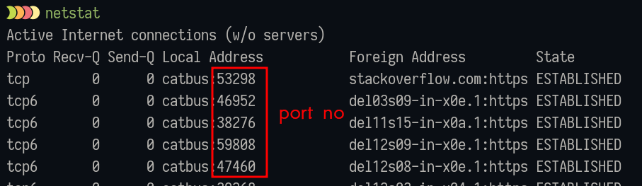

# Transport Layer

- use
    - main responsibility, transfer the data completely
    - receives the data from the upper layer and converts them into smaller units known as segments.
    - termed as an end-to-end layer,provides a point-to-point connection between source and destination to deliver data reliably.
    - ensures that messages are transmitted in the order in which they are sent and there is no duplication of data.
    - end to end delivery of the data
    - udp and tcp protocols are used
    - flow control - don't send more data
    - congestion control - too many packets in the network
    - segmentation - dividing into packets
    - error correction
- protocols
    - TCP
    - UDP
- pdu
    - segment

## Ports

- both udp and tcp have - (1-65535) number of ports, $2^{16} - 1 = 65535$
- because port no is a 18 bit number (2 byte)

---

- well known ports - 1 to 23
- registered ports - 1024 - 49151, assigned by IANA, internet assigned number authority
- dynamic ports, generated by pc, bound by the port you create on pc, rest of remaining ports
- use `netstat` on windows

## Some common ports

### tcp

- ftp - 21, file transfer protocol
- ssh - 22
- telnet - 23
- smtp - 25
- http - 80
- https - 443
- pop - 110
- dns - 53

### udp

- tftp - 69, trivial ftp
- dhcp - 67/68
- smtp
- dns - 53
