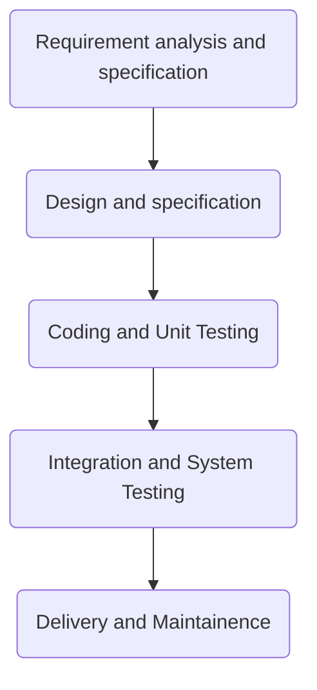
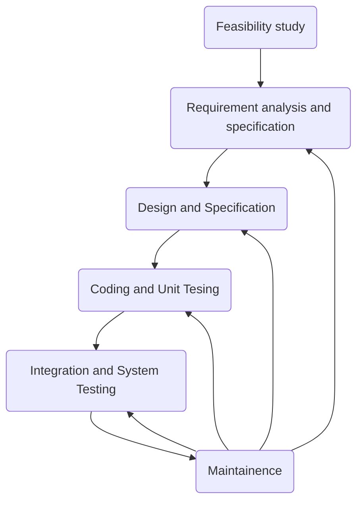
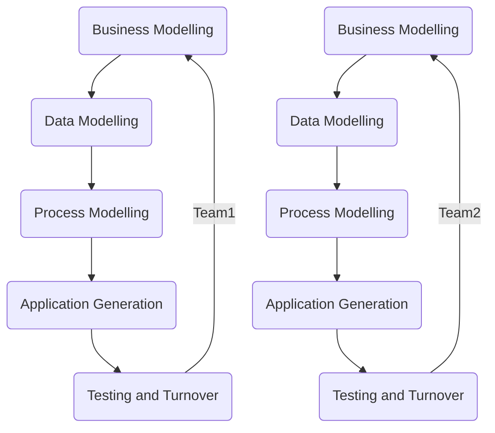
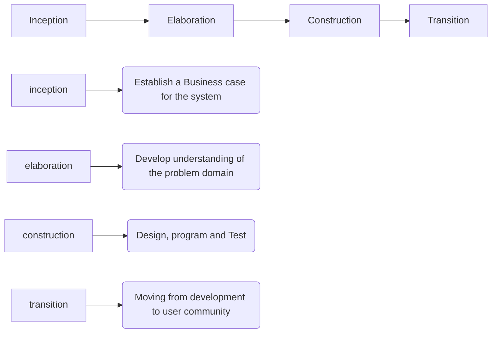
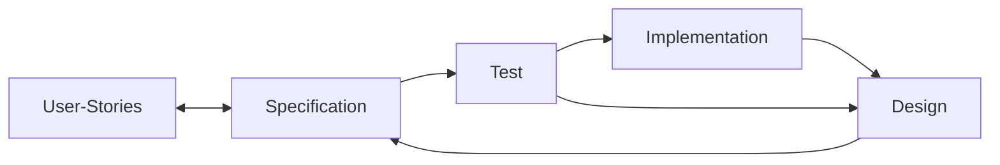

# Software Engineering

## ISO 9126 quality standards

- Functionality
- Reliability
- Usability
- Efficiency
- Maintainability
- Portability

## Software Crisis

The result of incremental failure rate of software development which led to an incomplete and degrading performance of software products.

### Causes

- Increasing Demand
- Increasing Complexity
- Increasing Challenges
- Same workforce
- Same methods
- Same tools

## Types of softwares

- System software

- Application software
- Scientific / Engineering software
- Embedded software
- Web application
- AI Software
- Networking software
- Business software
- Entertainment software
- Utility software
- Document management software
- Reservation software

## Software models

### Code and Fix Model

- Characteristics
    - Start coding right away and fix the bugs as we go

- Advantages
    - Convenient for small projects
    - Time saver for low budget products
    - Good for entry level developers
    - Full control over development process

- Disadvantages
    - Might run into huge unseen problems
    - Difficult to maintain and change later
    - Might have quality issues

### Waterfall Model (Winston W. Royce)

- Characteristics
    - Consists of a number of phases.
    - One phase cant be started before another's completion.
    - Work is divided among different class of specialists.
    - Work on one phase is frozen and documentation is passed on.



- Advantages
    - Simple and easy to understand
    - All phases are procesed one at a time
    - All phases well documented
    - Reduces development and maintainence cost
    - Enables organization
    - New person can take up an older project easily

- Disadvantages
    - Model does not allow phases to overlap, but they do in real life
    - Not a good model for long/ongoing softwares
    - Difficult to accomodatea any changes midway
    - No working software produced till the end of the lifecycle

### Iterative Waterfall Model



### V Model

- Characteristics
    - The verification and validation model
    - 

- Advantages
    - Easy to manage due to rigidity of the model
    - Defects are found at early stage
    - Simple to understand and follow

- Disadvantages
    - High risk and uncertainity
    - Not good for complex projects
    - Does not support iteration phases
    - Does not handle concurrent events

### Evolutionary Model

- Characteristics
    - Software is developed constantly
    - Get customer feedbacks to accomodate them

- **Incremental imlpementation**
    - Few functions are developed to get a working model.
    - Later more functions are added.

- **Prototyping**
  
    - A working prototype is provided to the user in order to get the feedback from the user.
        - Throwaway prototyping
        - Evolutionary prototyping

### Spiral Model


## Metrics for comparing SDLC models

- Shortfall - How far the software is from user requirements
- Lateness - Time delay
- Adaptability - Adaptation of software  to new requirements
- Longevity - Time till the software is replaced
- Inappropriateness - Measure behavior of shortfall over time

## Non-traditional development methods

### Rapid Application Development

- Based on prototyping and iterative development with no specific planning involved
- RAD produces a software in minimum time
- Use of powerful tools and techniques



### Rational Unified Process

Process independent lifecycle approach.



Perspectives or RUP

- **Dynamic perspective** shows phases of model over time
- **Static perspective** shows process activities that are enacted
- **Practice perspective** suggests good practices to be used during the process

### Agile Development Process

Used when the requirements change rapidly

[Manifesto](http://agilemanifesto.org/)

[Principles](http://agilemanifesto.org/principles.html)

| Principle             | Description                                                                                               |
| --------------------- | --------------------------------------------------------------------------------------------------------- |
| Customer involvemnet  | Customers should be closely involved throughtout the development phase                                    |
| Incremental delilvery | Customers specify the requirements in each increment                                                      |
| People not process    | Skills of development team should be recognized and exploited, rather than following a particular process |
| Embrace changes       | Expect the changes to the system so that they can be easily accomodated                                   |
| Maintain simplicity   | Wherever possible, stay simple                                                                            |



#### Extreme Programming

User explains the stories as scenarios called as *user stories*. The stories are then translated as tasks and are completed one at a time.

#### SCRUM

This is also an agile methodology where there are short sprints of 3 to 4 weeks and a full product
is developed within a single sprint. The *SCRUM master* leads the project and meetings are held on a
daily basis.

___

## Requirement analysis

### Types of requirements

- User requirements
- System requirements
- Stakeholders

Based on functionality

- Functional requirements
- Non Functional requirements
    - Product requirements
    - Organizational requirements
    - External requirements
    Metrics for measuring non-functional requirements
        - Speed
        - Size
        - Ease of use
        - Reliability
        - Robustness
        - Portability

## Requirements Engineering

1. Feasibility study
   - Technical feasibility
   - Operational feasibility
   - Legal feasibility
   - Schedule feasibility
2. Requirement elicitation and analysis
   - Interviewing
   - Observation and Ethnography
   - Scenarios
   - Use cases
   - Questionnaires
   - Survey
   - Existing manuals and documentation
   - Group discussion
   - Prototyping
3. Requirement specification
   - Documentation of user and system specifications.
   - It can be done as:
     - Natural Language Specification
     - Structured specification
     - Graphical notations
     - Mathematical specifications
       The official document that specifies sofware requirements is called as the **SRS** **document**. It is used by customers, managers, system engineers, system test engineers, system maintainence engineers.

       A good SRS document is concise, complete, correct, consistent, unambiguous, structured,verifiable, modifiable.

   - Specifications of SRS by IEEE

    ```python
    1. Introduction
        1. Purpose
        2. Project scope
        3. Definitions, acronyms and abbreviations
        4. Reference
        5. Overview
    2. Overall Descriptive
        1. Product perspective
        2. Product features
        3. User classes
        4. Operating environment
        5. Design and implementation constraints
        6. User documentation
        7. Assumptions and Dependencies
    3. Specific requirements
    4. Functional requirements
    5. External interface requirements
    6. User
    7. Hardware
    8. Software
    9. Communication
    10. Other non-functional requirements
    11. Other requirements
    ```

4. Requirement verification and validation
5. Requirements management

## Tools for requirement gathering

### Decision table

| Conditions  | Condition entries  |
| ----------- | ------------------ |
| **Actions** | **Action entries** |

### Decision tree

### Data flow diagram

A representation of how data flows and is stores in a system; Useful for data analysts, DBAs and end users

### Data dictionary

| Entry              | Value |
| ------------------ | ----- |
| Name of item       | ----  |
| Alias              | ----  |
| Description        | ----  |
| Related data items | ----  |
| Range of values    | ----  |

## Software Design

- Preliminary / high level design
- Detailed design
- Following items are designed during design phase
    - Modules
    - Control relationship among identified modules
    - Interfaces among the modules
    - Data structure of individual module
    - Algorithm to implement each module

- Characteristics of good software design
    - Correct
    - Understandable
    - Efficient
    - Maintainable
    - Complete
    - Consistent
  
### Software design principles

- Problem partitioning
- Increase abstraction
- Modularity
- Increase cohesion
- Reduce coupling
- Increase reusability
- Design for flexibility
- Portability
- Testability

#### Types of coupling

- Data coupling
- Stamp coupling
- Control coupling
- External coupling
- Common coupling
- Content coupling

#### Types of cohesion

- Functional
- Sequential
- Communicational
- Procedural
- Temporal
- Logical
- Coincidental

### Software design methodology

- Level oriented software design
    - Top down - Go into more depth, keep breaking down the system into smaller chunks. Used when design is to be done ground up.
    - Bottom up - Lowest level subsystems are designed first

- Function oriented
    - Design of data flow
    - Structure division
    - Detailed design

- Object oriented software design approach
  
    - ER model
    - Decision tree
    - DFD
    - Structure charts

### DFDs and Structre charts

- 0-level DFD or context diagram
    - Has single process for main task and its relationship with external entities.
- 1-Level DFD
    - More than 1 process/bubble. The major process is highlighted and is further divided into subprocesses.
- 2 level DFD
    - The data flow is also shown along with the processes.

### Functional independence

A module with high cohesion and low coupling is called as functionally independent of other modules. Functional independence is required because:

- Error isolation
- Scope of reuse
- Understandability
  
### Modularity

- Easy to understand the system
- System maintainence is easy
- Reusability
  
### Detailed design

- Short description of each function is provided in a tablula r format

## Design and Development

- **UML diagram** (Unified modelling language) - Show design of the system
- **Context model** - Show the scope of the system
- **Interaction modelling** - Show the user interface of the system
- **Use case diagram** - The actions to be performed by particular users on an entity
- **Sequence diagram** - Communication of entities based on time sequence
- **Structured model** - Show structure of model with relation among the components
- **Class diagram** - Shows class, attribute, function and inter-relationship
- **Behavioral diagram** - Show the behavior of an entity when an action is performed

### Architectural design

The organization and design of overall structure of a system is specified in architectural design. It is the starting stage of software design process. Link between requirement and design is specified at this stage. Non functional requirements are given utmost importance.

#### Advantages

- Stakeholder communication
- System analysis
- Large scale reuse

#### Architectural views

- Logical view
- Physical view
- Development view
- Process view

#### Types of architectures

- Layered
- Repository
- Client server
- Pipe and filter

## Development

- Selection of language

- Focus on reusability

- Configuration management

    - Version management
    - System integration
    - Problem tracking

- Host target development

- Coding

    - Modular
    - Notation / Comments
    - Portability
    - Debugging
    - Size of code
    - Cost of code

- Documentation

    - Introduction in README
    - Explain return values, parameters etc.
    - Naming convention for files
    - Names of contributors
    - License
    - Roles of developers / Contact
    - Version

- Code review

    - Are requirements covered ?
    - Is software design consistent ?
    - Is it a standard coding style ?
    - Are enough test cases generated ?
    - Is documentation complete ?
    - Major drawbacks / flaws
    **Types of code reviews**

        - Code walkthrough
        - Code inspection

## Testing

### Objectives of testing

- To find situations where software may malfunction (Verification) - "Are we making the product right ?"
- Show clients that software meets provided specifications (Validation) - "Are we making right product ?"

### Stages of software testing

- Development testing
    - Unit testing
    - Component testing
    - Integration testing
        - Top Down
        - Bottom Up
        - Mixed
        - Bing-Bang
- Release testing / Functional testing
    - Requirement based
    - Scenario based
    - Performance based
        - Speed
        - Scalability
        - Stability
        - Compatibility
        - Volume
        - Recovery
        - Maintenance
        - Documentation
    - Regression based
        - When existing system is upgraded
- User testing

## Maintenance

**Need to maintain**

- Fix the errors
- Business status change / User expectaions
- Software evolution
- Migration of legacy software

**Types of maintenance**

- Corrective
- Adaptive
- Perfective
- Preventive

**Reverse Engineering**

- Functionality is not changed, complex statements are simplified (Cosmetic changes)

- Complete code analysis, their modules and interfaces are understood, design is extracted, SRS is generated based on design

  **Benefits of reverse engineering**

    - Understanding the complexity
    - Find side effects
    - Recover lost information
    - Create new products
    - Explore reusability

## Software maintenance Process Model 1

- For small changes
- Few team members gather info, and formulate changes

## Software maintenance Process Model 2

- More rework is needed
- Combine reverse and forward engineering
- Called as software re-engineering
- Helps in software evolution
- Useful in Legacy software migration
- Reduces risk and cost of development

## maintenance

- COCOMO - Boehm
- Based on ACT (Annual change traffic)

$$
ACT = \frac{KLOC_{added}+KLOC_{deleted}}{KLOC_{total}}
$$

- **Factors affecting cost**
    - Technical (Changes in modules, programming languages, style etc.)
    - Non-technical (Scope, Stable team, Hardware, environment)

## Configuration management

**Release** - Minor change

**Version** - Major change

**Software configuration management process**

- Identification of the objects to be configured
- Controlling versions
- Controlling changes
- Audit configurations
- Generating status report

## CASE

- Computer aided software engineering
- Automated support in software engineering
- CASE tools for Structured analysis - Flow chart maker
- CASE tools for code generation - Code completion
- CASE tools for test case generation - SoapTest

### CASE tools classification

- Upper CASE tools
- Lower CASE tools
- Integrated CASE tools

## Project Management

**Duties of project manager**

- Project planning
- Reporting
- Risk management
- People management
- Proposal writing

## SPMP Document

| Name              | Details                                              |
| ----------------- | ---------------------------------------------------- |
| Introduction      | Objective, Functions, Performance issues, Constrains |
| Project estimates | Historical data, Cost duration, Effort estimates     |
| Project schedule  | Work breakdown using Gantt and PERT chart            |
| Project resource  | Manpower, Hardware, Software, Skills                 |

## Project Size allocation

- **LOC - Lines of code**

$$
LOC = \frac{S_{opt} + 4S_{m} + S_{pess}}{6}
$$

$$
\text{Productivity rate} = \frac{size}{effort}
$$

Example:

- Let number of men = 2
  LOC = 4800\\
  $$
  \text{Productivity rate} = \frac{4800}{men*12} LOC/man/month
  $$

- **FP - Functional point**
    - AFP = UFP $\times$ CAF\\
    AFP = Adjusted Functional Points\\
    UFP = Unadjusted Functional Points\\
    CAF = Complexity Adjustment Factor

## Project Estimation Techniques

- **Empirical**

    - Experts extimate the cost
    - Human judgement / errors / bias

- **Heuristic**

    - Technique 1
        - $\text{Estimated parameter} = c_{1}\times e^{d_{1}}\\$
        - $c_1$ and $d_1$ are constants determined from previous projects
        - $e$ is the estimate

    - Technique 2
        - $\text{Estimated parameter} = c_{1}\times e^{d_{1}}\ * c_{2}\times e^{d_{2}}...$
        - $c_1$ and $d_1$ are constants determined from previous projects
        - $e$ is the estimate

- **Analytical**

    - Halstead's Software science
    - Considers the following points
        - Length and vocabulary
        - Program volume
        - Potential minimum volume
        - Program level
        - Effort
        - Time

## COCOMO

Constructive Cost Model - Falls under Heuristic approach

### COCOMO - Basic

- Based on LOC

- Software projects can be divided as

    - Organic - Well understood, small team, good experience (2 kloc - 50 kloc)
    - Semi Detached - Mixture of experienced and unexperienced people (50 kloc - 300 kloc)
    - Embedded - Strongly connected and complex hardware (> 300 kloc)

$$
\text{Effort} = a_{1}\times (kloc)^{a_{2}} \text{person month}\\
T_{dev} = b_{1}\times\text{Effort}^{b_{2}} \text{months}
$$

a$ and $b$ are constants

### COCOMO - Intermediate

Attributes of COCOMO intermediate

- Product
- Personnel
- Computer
- Development environment

These factors determine **EAF - Effort Adjustment Factor**

### COCOMO - Complete

- Planning and requirement
- System design
- Detailed design
- Module cost and test
- Integration and test
- Cost constructive model

## Risk management

### Reliability

#### Reliability metrics

- ROCOF - Rate of occurrence of failure
- Behavior of software over time
- MTTF - Mean time to failure (Duration to track and fix an error)
- MTTR - Mean time to repair
- MTBR - Mean time between repair (MTTR + MTTF)
- POFOD - Probability of failure on demand
- Availability

### Types of failure

- Transient - Due to certain input values
- Permanent - All input values
- Recoverable - Can recover without manual help
- Unrecoverable - Needs to be restarted
- Cosmetic - Minor failures

## ISO 9000

**International Standards Organization**

Provides guidelines to maintain ISO certification. Is not concerned with the product itself.

### ISO 9001

- Design, development, product and servicing of product use this standard

### ISO 9002

- For companies not involved in design, but in production

### ISO 9003

- Only for companies involved in installation and testing

## analytical estimation

- $\eta_1$ no of unique operation
- $\eta_2$ no of unique operands
- $N_1$ no of operators
- $N_2$ no of operands
- $N = N_1 + N_2$ - length of code
- $\eta = \eta_1 + \eta_2$ vocabulary of code
- $V = N \log_{2}{\eta}$ - volume of the code
- $V^*  = (2+\eta_2) \log_2{(2+\eta_2)}$ - potential minimal volume
- $L = V^*/V$ - program level - level of abstraction
- $E = V/L = V^2/V^*$ - effort
- $T = E/S$ - time, S - speed of mental discrimination
- $N = \eta_1 \log_2{\eta_1} + \eta_2 + \log_2{\eta_2}$ - length estimation

## Summary

### software development life cycle

- software vs program
    - program is simple and usually a single source code file
    - software is a complex piece where more than one program are combined
- characteristics/features of a software
    - functionality - does it do what it was made for
    - reliability - how many times it break
    - usability - how much easier it is to use, learning curve
    - efficiency - how much resources it use
    - maintainability - how much it is easier to add feature of a fix
    - portability - can it run on multiple platforms
- software crisis
    - why it occurred?
        - increasing demand
        - increasing complexity
        - increasing challenges
        - same workforce
        - same methods
        - same tools
    - consequences?
        - project running over budget
        - project running over time
        - software very inefficient
        - projects were unmanageable and code difficult to maintain
        - software of low quality
        - the software often did not meet requirements
- types of software
    - system
    - application
    - scientific engineering
    - embedded
    - web
    - ai
    - networking
    - business
    - entertainment
    - utility
    - document management
    - reservation

- software development life cycle
    - used by software industry to design, develop and test high quality software.
- models
    - code and fix
    - waterfall model
    - iterative waterfall model
    - V-model
    - evolutionary model
        - incremental implementation
        - prototyping
            - throwaway
            - evolutionary
    - spiral
    - software reuse
- comparing sdlc models
    - factors
        - shortfall - a measure how far the software is from meeting user requirements
        - lateness - time delay between appearance of new requirement and its fulfillment
        - adaptability - rate at which software can adapt to new requirements
        - longevity - time form system creation till its replacement
        - inappropriateness - measure of behavior of shortfall over time

- non traditional software development process
    - rapid application development (RAD)
        - business modeling
        - data modelling
        - process modelling
        - application generation
        - testing and turnover
    - rational unified process
        - inception
        - elaboration
        - construction
        - transition
    - agile development process
        - extreme programming (XP)
        - SCRUM

### requirements

- requirements
    - types
        - system
        - user
        - functional
        - non functional
            - product
            - organizational
            - external
- requirement engineering process
    - feasibility study
        - technical
        - operational
        - legal
        - schedule
    - requirement elicitation and analysis
        - process
            - requirement discovery
            - requirement classification and organization
            - requirement prioritization and negotiation
            - requirement specification
        - techniques
            - interviewing
            - observation
            - scenarios
            - use cases
            - questionnaires
            - survey
            - existing manual
            - group discussion
            - prototyping
            - brainstorming
    - requirement specification
        - how to write (specification)
            - natural language
            - structured
            - graphical notation
                - uml
            - mathematical
            - srs standards - ieee
                - good srs
                    - correctness
                    - completeness
                    - consistency
                    - concise
                    - structured
                    - unambiguous
                    - verifiable
                    - modifiable
                    - traceable
                    - testable
    - requirement verification and validation
        - validation checks
            - validity -
            - consistency - requirements should not conflict
            - completeness
            - realism - can sol. be implemented within time and available check
            - verifiability - can we write test to demonstrate that software meet srs
    - requirement management
- tools for requirement gathering
    - decision tables
        - condition entities
        - action entities
    - decision tree
    - data flow diagrams
        - made of
            - data flow - arrow
            - data transform or process - circle
            - data store - box open at one end
            - external entity - rectangle
        - level0
        - level1
        - level2
    - data dictionaries

### software design

- Software design
- activities
    - high level design
    - detailed design
- good software design
    - correctness
    - understandability
    - efficiency
    - maintainability
    - completeness
    - consistency
- principles
    - problem partitioning
    - increasing abstraction
    - modularity
    - increase cohesion
    - reduce coupling
    - increase reusability
    - design for flexibility - should be flexible to anticipate changes
    - design for portability
    - design for testability
- level oriented software design
    - bottom up
    - top down
- function and object oriented software design
    - er model
    - decision tree
    - dfd
        - 0 level - context diagram
        - 1 level
        - 2 level
    - structure charts
- cohesion
    - coincidental - randomly put together
    - logical - similar functions
    - temporal - functions executed at same period
    - procedural - working for same algo and goal
    - communicational - all function refer to or update same data structure
    - sequential - elements are part of a sequence
    - functional - all elements work together to achieve a single task
- coupling
    - data - communicate through a parameter - int bool
    - stamp - through a c like structure
    - control - data from one is used to direct the order in another
    - common - global items
    - content - they share code
- functional independence
    - error isolation
    - scope of reuse
    - understandability

- object oriented design (ood)
    - class
    - abstraction
    - encapsulation
    - inheritance
    - polymorphism
- UML in ood
    - things - class, object, interface
    - relationships -
    - diagrams
    - structural diagram - class diagrams show object classes and associations between them
    - interaction diagram - show interactions
    - behavioral diagrams - activity diagrams which show activities involved in process of data
- Context Models
- Interaction Models
    - use case diagram
    - sequence diagram
- Structured Models
    - class diagrams
- Behavioral Diagrams
    - data drive modelling
        - activity diagram
    - event driven modelling

- Architectural Design
- Architectural Views
    - logical view
    - process view
    - development view
    - physical view
- Architectural Patterns
    - Layered
    - Repository
    - Client-server
    - Pipe-filter

- Development
    - Selection of a language
    - Reuse of the software
    - Configuration management
        - Version management
        - System integration
        - Problem tracking
    - Host target development
- Coding
- Coding guidelines
    - small and easy to understand
    - module - date of creation, who creates, use
    - naming convention
    - no goto
    - code documentation
- Coding Documentation
    - README
    - functionality of each module
    - naming conventions
    - name of contributors
    - license and version
- Code Review
    - code walkthrough
    - code inspection

### testing

- bugs - defect informally
- defect - system not meeting the requirement
- error - mistake in code is called error
- fault - the state of incorect working of a system
- failure - when multiple defects occur

- Intro
    - Testing Objectives
        - validation testing
        - defect testing - where srs is not met
    - verification vs validation
        - vefification
            - srs, design, and code are checked
            - may not include program execution
            - code inspection, reviews, walkthroughs
        - validation
            - done in the end
            - generic process that is used to endure srs is met
    - Software Insepection
- Testing Process
    - Development Testing
        - Unit Testing
            - Test Case generation
                - Partition testing - equivalence classes
                - guideline based testing - based on experience
        - Integration Testing
            - big bang integraiton testing
            - Top down integration testing
            - bottom up integration testing
            - sandwitch integration testing
    - Release Testing of functionality testing
        - requirement based testing - based on srs
        - scenario testing - bases on real world scenarios
        - performace testing
            - stress testing - light load - high load
            - volume testing - data structures used are tested for overflow
            - configuration testing - configutation of hardware and software is verified
            - compatibality testing - compatibility between hardware, os, browser
            - recovery testing - system respoonse to faults, loss of service such as power
            - maintainance testing - testing performed on alresdy installed system
            - documentation testing -
            - usability testing - user interface is tested
            - regression testing - testing when an existing system is changed orr upgraded
        if there are new bugs after additon of new features or performace issues
    - User Testing or System Testing
        - alpha testing
            - tesing team and developers
        - beta testing
            - friendly customers
        - acceptance testing
            - end user test the system and decide whether the system is ready for deployment
- Structural and functional testing
    - structural testing - **white box, clear box**
        - test code, code specification, input output constrians, data structure
    - functional testing **black box testing**
        - check srs
    - White box testing
        - statement coverage testing
            - test cases are such that every statement should be executes once
        - Branch Coverage testing
            - test cases are such that every branch should be executed once
            - stronger than statement
        - Condition testing
            - each expression is tested
            - $2^n$ test case required
            - used when n is small
        - Path testing - used control flow graph (CFG)
            - path are tested which are linear independent
            - **Cyclometric complexity**
                - method 1: $C(G) = E-V+2$
                - method 2: total no of bounded areas + 1
                - method 3: total no of decision statement + 1, also called **McCabe's meric**
        - Mutation Testing
            - change some code randomly and check if errors are generated by the
        test cases
    - **Black Block Testing** or behavioural testing
        - test input and output
        - stratigies
            - use equivalence classes
            - boundary value testing
            - decision table testing
- Static Testing Stratigies
    - missing requirements, inconsistencies in interface desing, deviation form target problem
    - no execution of code
    - Review
        - informal
        - walk through
        - peer review - team member check each other code
        - insepection - srs used to verify the code by higher authorities
    - static analysis
        - quality of developed code evaluated
        - defect - syntax error, variable that is not used, unwanted code, infinte loop
        - test used
            - data flow checking
            - control folw
            - identification of linearlty independent paths
- Automated testing
    - using test suite
    - not cost effective
    - when to use
        - critical software high risk,
        - repeated execution of test cases
        - lengthy codewith high volume

### project management and mamagement

- COCOMO Constructive Cost Model
    - $\text{effort} = a_1 * (\text{KLOC})^{a_2} \text{ PM}$
    - $\text{time}_{dev} = b_1 * (\text{effort})^{b_2} \text{ months}$
- ISO 9000 standard
    - guidelines for producing the product
    - not concerned with teh product itself
    - types
        - 9001 - applies to most software organizations
        - 9002 - standard focus on manufacturing not for software products
        - 9003 - organizations involved only in installation and testing ofd products
    - iso cerification - customer gets confidence in product
    - does not gaurantee the high quality of the process
    - heavy emphasis on documentation and take lot of time and effort
- SEI CMM - software engineering institute capibility maturity model
