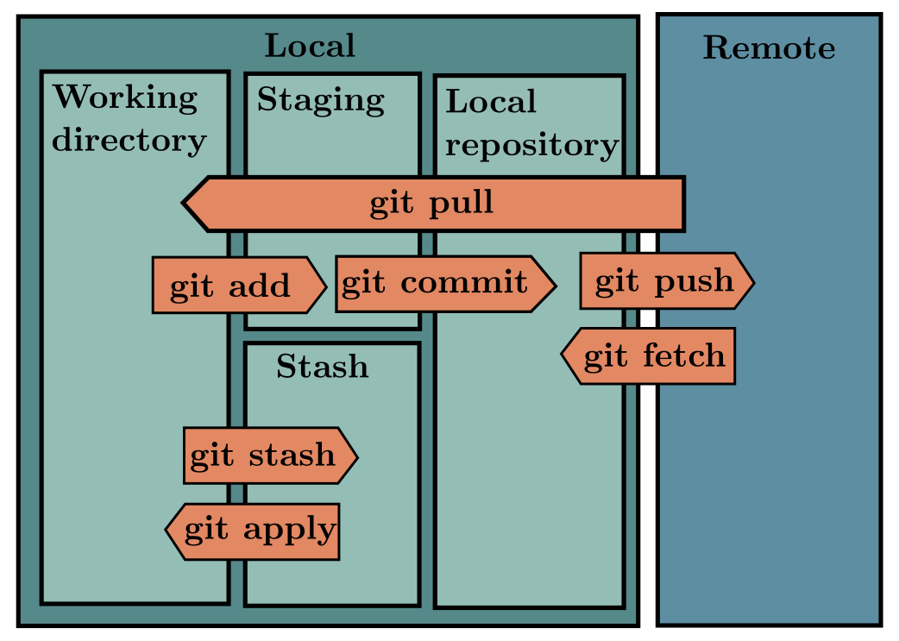

# How git works

- files can be
    - `untracked` - that is not beign tracked by git
    - `unmodified` - that is they are tracked by git, but are not modified since last commit
    - `modified` - that is they are modified since last commit
    - `staged` - that is files which are ready to be commited

- `git init` - create a git repo
- `git clone https://github.com/shivanshu-semwal/ds-ml` - clone a repo over `https`
- `git clone git@github.com:shivanshu-semwal/ds-ml.git` - clone a repo over `ssh`
- `git add [filename]` - start tracking `filename`
- `git status` - show status of files, (`untracked`, `unmodified`, `modified`, `staged`)
- `git status -s` - show git status in short
    - it will show 3 columns
    - first one show file status in staging area
    - second one show file status in the working tree
    - this one shows the file name
    - `??` - means file is untracked
    - `A` - means file is added to tracking area
    - `M` - means file is modified
- `git commit -m "Title" -m "Description"` - commit the file in the staging area, the become `unmodified` after commiting
- `git commit -a -m "msg"` - skip staging area and directly commit all changes to tracked files, removes the need to do `git add`
- `git rm [filename]` - make a file untracked
- `git rm --cached [filename]` - remove a file form staging area, accidently staged
- `git mv [filename] [newfilename]` - change name and location of a tracked file
- `git diff` - show the changes in current working tree
- `git diff --cached` or `git diff --staged` - show the change in the files in staged area, useful to check what will be on next commit
- `git log` - show commit history, in reverse chronogical order
- `git log -p` - show commit history, and also the files change and what changed
- `git log -2` - show last two commits
- `git log --stat` - show git log in summary
- `git log --pretty=oneline` - show git logs in one lines
    - `short` `full` `fuller`
    - also you can give custom format, `git log --pretty=format:"format"`

Specifier | Description
---|---
%H  | Commit hash
%h  | Abbreviated commit hash
%T  | Tree hash
%t  | Abbreviated tree hash
%P  | Parent hashes
%p  | Abbreviated parent hashes
%an | Author name
%ae | Author email
%ad | Author date (format respects the --date=option)
%ar | Author date, relative
%cn | Committer name
%ce | Committer email
%cd | Committer date
%cr | Committer date, relative
%s  | Subject

- `git log --graph` - show commit history in graph view
- `git log --since=2.weeks` - limiting git log output to certain time
- `git log -S function_name` - show all cahnges that changes the `function_name` word
- `git log -- path/to/file` - show commits which changes the file or path provided

- `git commit --ammend` - fix the last commit message, file added to staging area will also be commited in this commit
- `git reset HEAD <file>` - remove the file from the staging area
-
