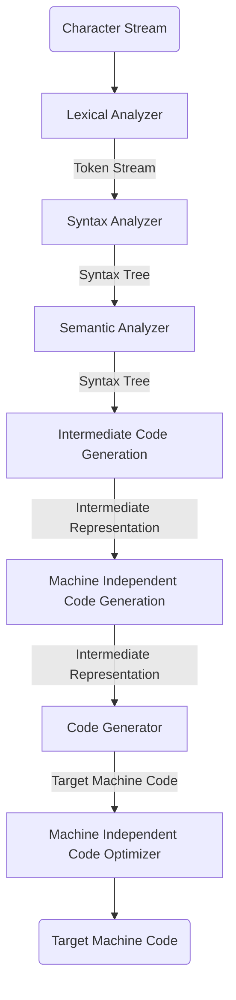
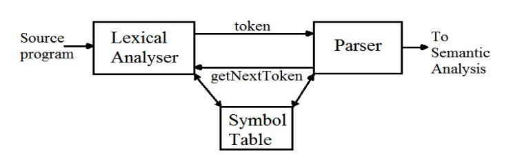
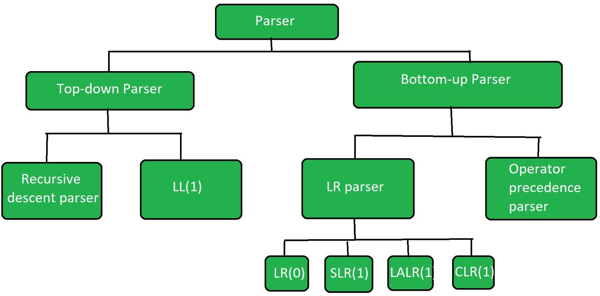

# compiler design

- [tutorial point]
- [gfg]
- [jp]
- [nptl videos]

## introduction

- compilers for c

    - gcc
    - llvm

- lexical parsers
    - [bison](https://en.wikipedia.org/wiki/GNU_Bison)
        - uses BNF notation (a context free language)
    - yacc - yet another compiler compiler
    - lex - used for lexical analysis
    - flex - another version of the lex tool, which is open source

[tutorial point]: https://www.tutorialspoint.com/compiler_design/index.htm
[gfg]: https://www.geeksforgeeks.org/introduction-of-compiler-design/
[jp]: https://www.javatpoint.com/compiler-tutorial
[nptl videos]:
  https://www.youtube.com/watch?v=7Nb-NTGbe-Q&list=PLbRMhDVUMngcseCW7wXDvtTDemCuH80fP&index=3

## compile vs interpreters

### compiler

- scans the entire program and translates the entire program into target code
- take time to analyze the source code - overall execution is faster than
  interpreters
- generate the intermediate object code which require further linking - hence
  more memory
- debugging is hard
- e.g. - c cpp c#

### interpreters

- line by line execution
- less time to analyze the source code - overall execution time is more than
  compilers
- no intermediate code is generates - so less memory needed
- better error diagnostics
- e.g. - javascript, python,

## compiler generate three types of code

- pure machine code -
    - for embedded applications
    - doesn't assume existence of any machine code
-

## phases of compiler

## Lexical analysis

## Passes of Compiler

## Passes of GCC

## Compiler Construction Tools

## Parsing

## Types of Parsing

## Recursive Descent Parsing

## Predictive Parsing

## Calculation of First

## Calculation of Follow

# compiler

- read a program in one language, source language
- and translate it into another language, target language

# interpreter

- directly executers the operations specified in the source file and on given
  data

# structure of compiler

- lexical analyzer
- syntax analyzer
- semantic analyzer
- intermediate code generation
- machine independent code optimizer
- code generator
- machine dependent code optimizer



# Lexical analyzer



# Parser



## top down parser

- generates parse tree for given input string with help of grammar productions
  by expanding non-terminals
- it start at start symbol and end at terminals
- uses left most derivation

- recursive decent parser - use backtracking
- non recursive decent parser - `LL(1)` - use parsing table (`first()`,
  `follow()`)

## bottom up parser

- generates the parse tree for given input string with help of grammar
  productions by compressing non-terminals
- starts on non-terminals and end at start symbol
- uses reverse of right most derivation

<br>

- LR - generates parse tree by using some unambiguous grammar.
- operator precedence parser - two consecutive non-terminals and epsilon never
  appear on right side of production

# parsing

## `first()`

$\text{first}(A)$ contains all terminals present in first place of every string
derived by $A$

- $X \rightarrow abc$
    - $\text{first}(X) = \text{first}(a) = \{a\}$
- $X \rightarrow \epsilon$
    - $\text{first}(X) = \{\epsilon\}$
- $X \rightarrow A$, $A \rightarrow m$
    - $\text{first}(X) = \text{first}(A) = \{m\}$

## `follow()`

$\text{follow}(A)$ contains set of all terminals present immediate to right of
$A$

- $\text{follow}(A)$ never contains $\epsilon$
- $\text{follow}(S) = \{\$\}$, follow of start symbol
- $X \rightarrow ABC$,
    - $\text{follow}(B) = \text{first}(C)$
    - $\text{follow}(C) = \text{follow}(X)$

<br>

- $\text{follow}(S) = \{\$\}$, follow of start symbol
- $X \rightarrow \alpha B \beta$
    - $\text{follow}(B) = \text{first}(\beta)$
    - $\text{follow}(B) = \text{first}(\beta) - \{\epsilon\} \cup \text{follow}(\beta)$,
    if $\epsilon \in \text{first}(\beta)$
- $X \rightarrow \alpha B$
    - $\text{follow}(B) = \text{follow}(X)$

## left recursion

- if grammar contains production of form $$A \rightarrow A \alpha | \beta$$
- it it left recursive grammar
- to remove left recursion
- Convert $$A \rightarrow A \alpha | \beta$$ to
  $$
  A \rightarrow \beta A' \\
  A' \rightarrow \alpha A' | \epsilon
  $$

## left factoring

- if grammar contains production in form
  $$A \rightarrow \alpha \beta_1 | \alpha \beta_2 | ... | \alpha \beta_n$$
- to eliminate it, write it in the form
  $$
  A \rightarrow A' \\
  A' \rightarrow \beta_1 | \beta_2 | ... | \beta_n
  $$

# LL(1)

- find **first** and **follow** sets of the grammar given
- create paring table, add dollar with terminal
- now for production
    - $A \rightarrow \text{RHS}$, fill it in $(A, \text{first}(\text{RHS}))$
    - $A \rightarrow abc$, fill it in $(A, \text{first}(abc))$
    - if $A \rightarrow \epsilon$, fill it in $(A, \text{follow}(A))$

Grammar

- $1$ $S \rightarrow (L)$
- $2$ $S \rightarrow a$
- $3$ $L \rightarrow SL'$
- $4$ $L' \rightarrow \epsilon$
- $5$ $L' \rightarrow ,SL'$

| \_   | `first`        | `follow` |
| ---- | -------------- | -------- |
| $S$  | $($ $a$        | $ $)$    |
| $L$  | $($ $a$        | $)$      |
| $L'$ | $,$ $\epsilon$ | $)$      |

- $S \rightarrow (L)$
    - $S$ and $($
- $S \rightarrow a$
    - $S$ and $a$
- $L \rightarrow SL'$
    - $L$ and first$(S)$
    - $L$ and $($
    - $L$ and $a$
- $L' \rightarrow \epsilon$
    - $L'$ and follow$(L')$, because of $\epsilon$
    - $L'$ and $)$
- $L' \rightarrow ,SL'$
    - $L'$ and $,$

| \_   | (   | )   | a   | ,   | $   |
| ---- | --- | --- | --- | --- | --- |
| $S$  | 1   |     | 2   |     |     |
| $L$  | 3   |     | 3   |     |     |
| $L'$ |     | 4   |     | 5   |     |

## how to parse string in `LL(1)`

```cpp
bool ll_1_parser(string s, string[][] parsing_table){
  stack<char> st;
  st.push('$'); // default

  int i = 0; // look ahead symbol
  while(i < s.length()){
    char tos = st.top(); // top os stack
    st.pop();

    stack.push(reverse(parsing_table[tos][s[i]]));
    if(isTerminal(st.top())){
      if(st.top() == s[i]){
        i++; // move look ahead on matching
      }
    }
  }

  if(st.empty()) return true; // string accepted
  else return false; // string not accepted
}
```
