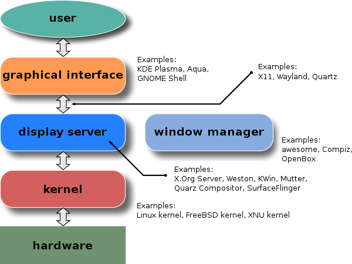

# Display Servers

[Wikipedia: Display Server](https://en.wikipedia.org/wiki/Windowing_system#Display_server)
[Wikipedia: List of Display servers](https://en.wikipedia.org/wiki/List_of_display_servers)

In computing, a windowing system (or window system) is a software suite that manages separately different parts of display screens.

## Xorg Display Server

- [Archwiki: Xorg](https://wiki.archlinux.org/title/Xorg)

### Clipboard

Xorg offeres two clipboard:

- `primary` - which activates with middle mouse click
- `seconday`
- `clipboard` - which is the proper clipboard
- `buffer-cut`

Access these with, `xclip -selection [type]`

### Commands

> these runs specifically on which were made for `xorg`

- `xbacklight` - adjust backlight brightness using RandR extension
- `xcalc` - calculator
- `xchop` - pacman game clone
- `xclip` - command line interface to X selections (clipboard)
- `xclock` - clock
- `xcwd` - get current directory opened in the focused windows, like terminal
- `xdotool` - command-line X11 automation tool
- `xdpyinfo` - display information utility for X
- `xditview` - display ditroff output
- `xedit` - text editor
- `xeyes` - eyes follow cursor
- `xfd` - display all the characters in an X font
- `xev` - print contents of X events
    - capture all inputs in xserver
    - useful to find the keycode for used in other programs configuration
- `xkill` - kill a client by its X resource
- `xprop` - property displayer for X
    - property displayer for X
- `xsel` - manipulate the X selection.
    - `xsel -b > mpv.png`
    - `xsel -b > mpv.png`
    - `xsel -b mpx.png`
    - `xsel | festival --tts`
    - `xsel | festival --tts`
    - `xsel | festival --tts`
- `xwd` - dump an image of an X window
- `xman` - gui manual
- `xmessage` - display a message or query in a window (X-based /bin/echo)
- `xprintidle` - utility printing user's idle time in X
- `xrandr` - X Resize, Rotate and Reflection extension
- `xrdb` - X server resource database utility
    - X server resource database utility
    - `xrdb -query`
    - `xrdb -query -all`
    - `xrdb -query | grep dpi`
- `xset` - user preference utility for X
- `xsm` - X Session Manager
- `xwininfo` - window information utility for X

## Wayland Display Server

- [https://wayland.freedesktop.org/](https://wayland.freedesktop.org/)