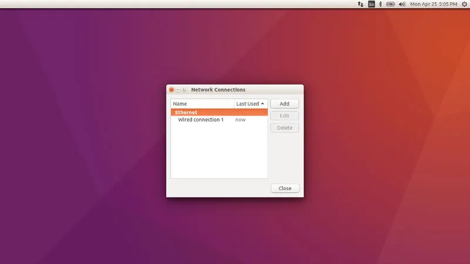
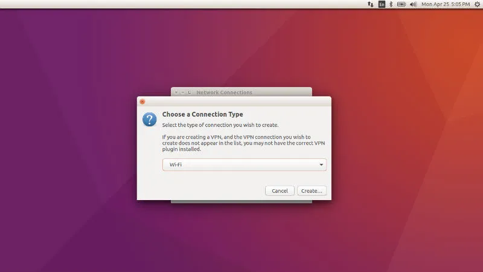
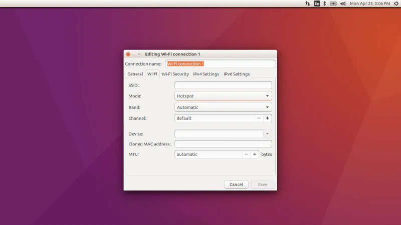
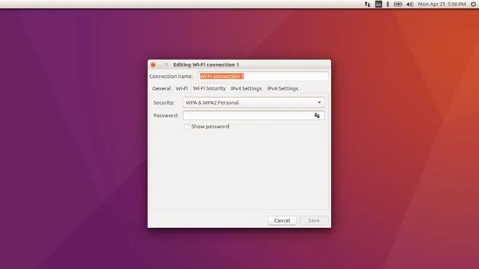
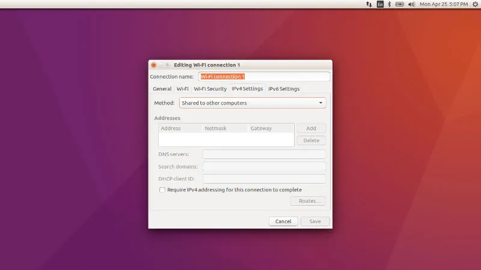
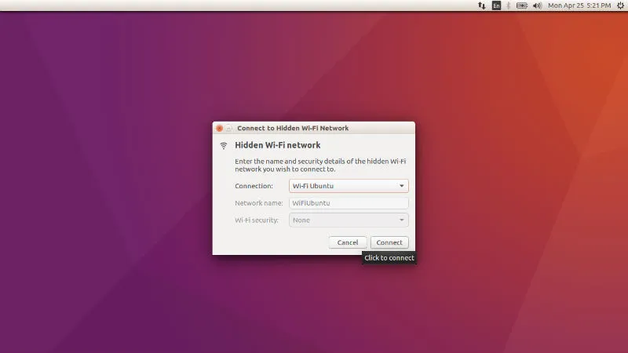

# Create a Wifi Hotspot on Linux/Ubuntu

Set up your wireless network connection in Ubuntu 16.04. How to create Wifi Hotspot in Ubuntu 16.04, with Android support.

Before you start to create WiFi Hotspot in Ubuntu 16.04, disable WiFi and plug in a wired Internet connection to your laptop/PC. Please makes sure that the Ubuntu is connected to a wired Internet and wireless is disabled.

1. Disable WiFi and connect to a wired Internet connection.
2. Go to Network Icon on top panel.
      
3. Select Edit Connections and then click the Add button (in the pop-up window). You can also select Create New WiFi Network.
      
4. Choose Wi-Fi from the drop-down menu (under connection type).
      
5. In next window, do the following
    - Type in a connection name. Please note this name as we will use the name later.
    -   
    - Type in a SSID
    - Select mode: Infrastructure
    - Device MAC address: Select your wireless card from drop-down menu
    - In Wifi Security tab, select WPA & WPA2 Personal and type in a password.
    -   
    - In IPv4 Settings tab, select mode "Share to other computers"
    -   
6. Go to Wi-Fi Security tab, select security type WPA & WPA2 Personal and set a password.
7. Go to IPv4 Settings tab, from Method drop-down box select Shared to other computers.
8. Click the save button.
9. Now connect to the WiFi Hotspot created.
    -   

## If You Are Having An Error

- Once you have completed the above steps, a configuration file with the newly created
    connection name is created under /etc/NetworkManager/system-connections directory. We will now
    edit this configuration file. Open Terminal and run the following command to edit the
    configuration file: `gksu gedit /etc/NetworkManager/system-connections/wifi-connection-name`
- Please note that that you must replace wifi-connection-name with the new connection name you
    just created. When the file opens, search the line "mode=infrastructure" and change it to
    "mode=ap" and save the file.
- Restart the system and enable WIFI from Network Manager icon on the Ubuntu panel bar. It will
    automatically connect to the newly created WiFi hotspot. If it is not connected automatically,
    select "Connect to Hidden Wi-Fi Network" and select the newly created WiFi hotspot from the
    drop-down list.
