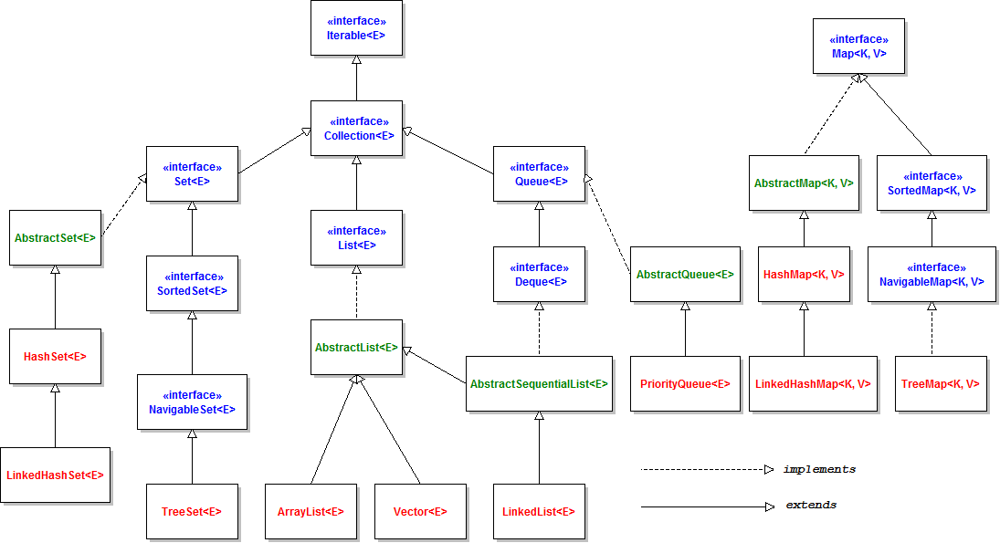

# Collections



- Java doesnt Support Operator Overloading Except for one case i.e
  `+` operator it can be used to add number as well as strings.
- So you will have to use methods in java collections, no `[]` operator or no
  comparision operators like,`<` , `>` , `=`
- Collections can only work with Objects, so you can't use `int`, you have to use
  wrapper class `Integer` objects.

## Building Blocks

- Collections are made of java `Arrays` and some self referential classes.

```java
class Node<T>{
    T val;
    Node next;
}
```
