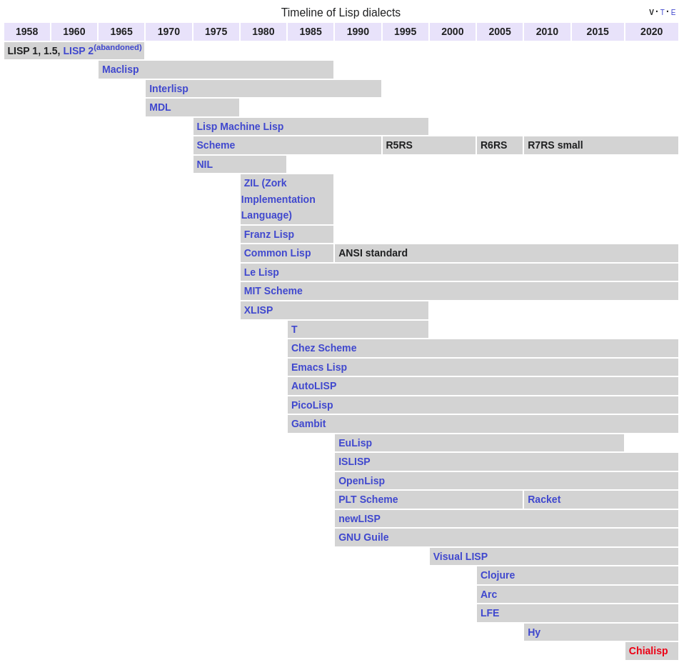

# LISP

- LISP is a family of programming language, which uses fully parenthesized prefix notation.
- <https://en.wikipedia.org/wiki/Lisp_(programming_language)>

Lisp is one of the oldest programming languages, known for its unique parenthetical syntax and its powerful features for symbolic computation, recursion, and rapid prototyping. It has influenced many other programming languages and is still used in various specialized areas today.

- Artificial Intelligence (AI)
   - Examples: Expert systems, natural language processing, and symbolic reasoning.
   - Details: Lisp has a long history in AI research and development due to its flexibility and support for symbolic computation. For example, the early AI program "ELIZA," a simple natural language processing chatbot, was written in Lisp. The Cyc project, a large-scale AI system for knowledge representation, also uses Lisp.

- Rapid Prototyping
   - Examples: Prototype-based systems, research tools, and experimental software.
   - Details: Lisp's interactive development environment and dynamic typing make it ideal for rapid prototyping. Researchers often use Lisp to quickly build and test new algorithms, models, or systems before implementing them in other languages.

- Symbolic Computation and Mathematical Applications
   - Examples: Computer algebra systems, symbolic differentiation, and theorem proving.
   - Details: Lisp is well-suited for symbolic mathematics, where expressions are manipulated as symbols rather than evaluated numerically. For example, the computer algebra system Maxima, which handles symbolic differentiation and integration, is written in Lisp.

- Domain-Specific Languages (DSLs)
   - Examples: Custom scripting languages, configuration languages, and macro systems.
   - Details: Lisp's macro system allows developers to create powerful DSLs tailored to specific tasks. For example, Emacs Lisp is a dialect of Lisp used to extend and customize the Emacs text editor, allowing users to create custom commands, modes, and automation scripts.

- Education
   - Examples: Teaching programming concepts, recursion, and functional programming.
   - Details: Lisp is often used in educational settings to teach fundamental programming concepts, particularly recursion and functional programming. The book "Structure and Interpretation of Computer Programs" (SICP), which uses Scheme (a Lisp dialect), is a classic textbook in computer science education.

- Emacs Text Editor
   - Examples: Text editing, IDE customization, and task automation.
   - Details: GNU Emacs, a highly extensible text editor, is almost entirely written in Emacs Lisp. Users and developers can extend and customize Emacs by writing Emacs Lisp scripts to add new functionality, automate tasks, and create custom workflows.

- Metaprogramming
   - Examples: Code generation, transformation systems, and compiler construction.
   - Details: Lisp's macro system allows for powerful metaprogramming, where code can generate and manipulate other code. This feature is often used in compilers and interpreters to perform code transformations and optimizations.

- Robotics
   - Examples: Robot control systems, AI-driven robotics, and simulation environments.
   - Details: Lisp is used in robotics for tasks that require symbolic reasoning and AI, such as planning and decision-making. For example, the "ROBOT" programming language, based on Lisp, was developed for robot control systems.

- Web Development (Historically)
   - Examples: Early web applications, dynamic content generation.
   - Details: Lisp was used in early web development frameworks, such as "CL-HTTP," one of the first web servers written in Common Lisp. Although less common today, Lisp was used to create dynamic content for websites in the early days of the web.

- Software for Complex Systems
   - Examples: Aerospace software, control systems, and research platforms.
   - Details: Lisp has been used in the development of complex software systems where flexibility and rapid development are essential. For instance, the planning software used in the NASA Deep Space 1 mission was written in Lisp, allowing for advanced autonomous decision-making.

- Interactive Development Environments
   - Examples: REPL (Read-Eval-Print Loop) based development, debugging tools.
   - Details: Lisp's interactive environment, which includes a REPL, makes it ideal for exploratory programming and debugging. Developers can write, test, and modify code in real-time, which is particularly useful for research and experimental development.

- Game Development (Niche)
   - Examples: Scripting for game AI, procedural content generation.
   - Details: In some niche areas of game development, Lisp has been used for scripting AI behavior and generating procedural content due to its symbolic processing capabilities. For example, the game "Jak and Daxter" used a custom Lisp dialect for scripting game logic.

