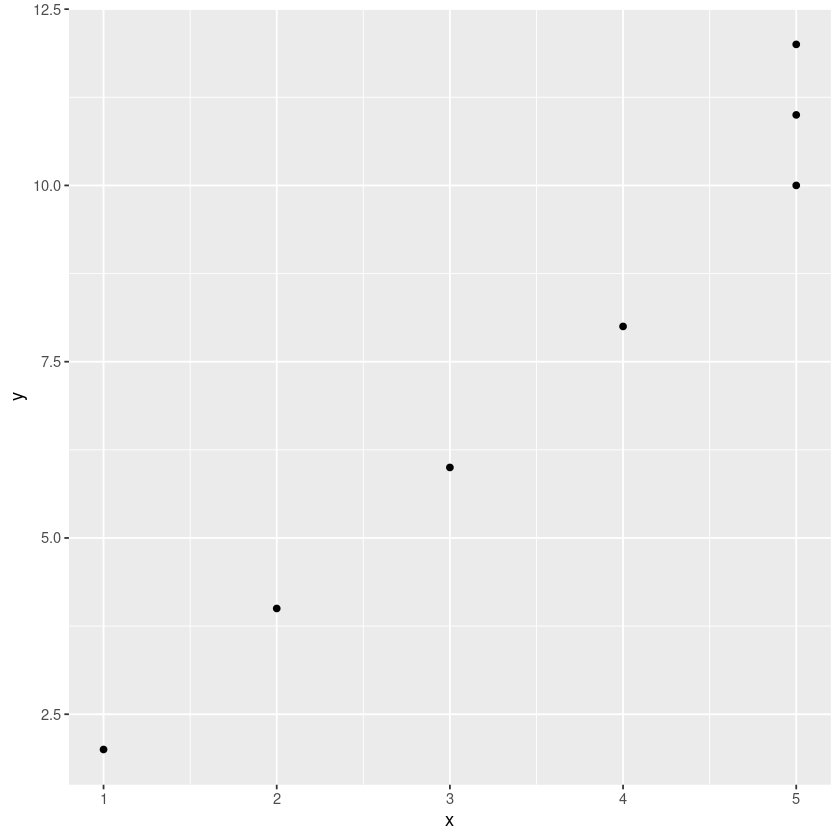
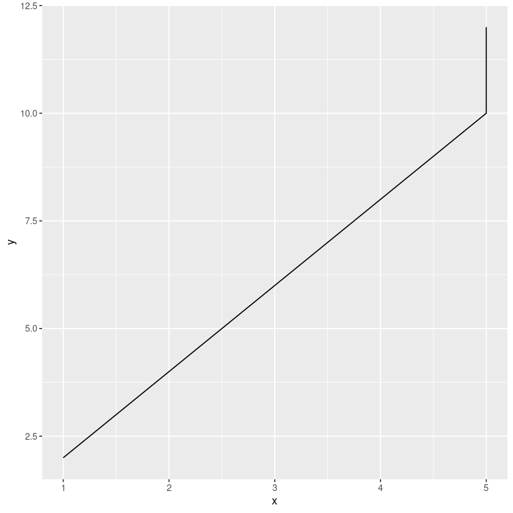
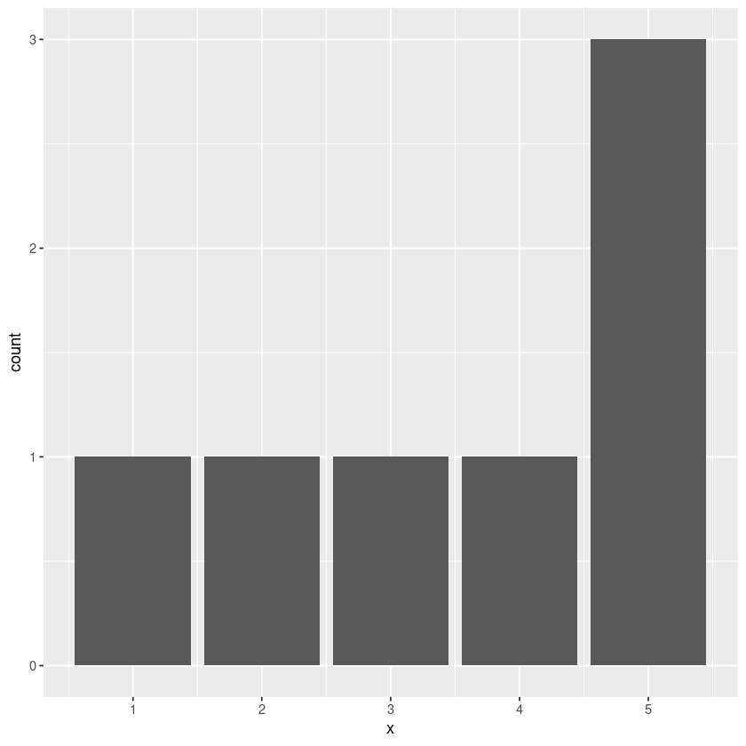
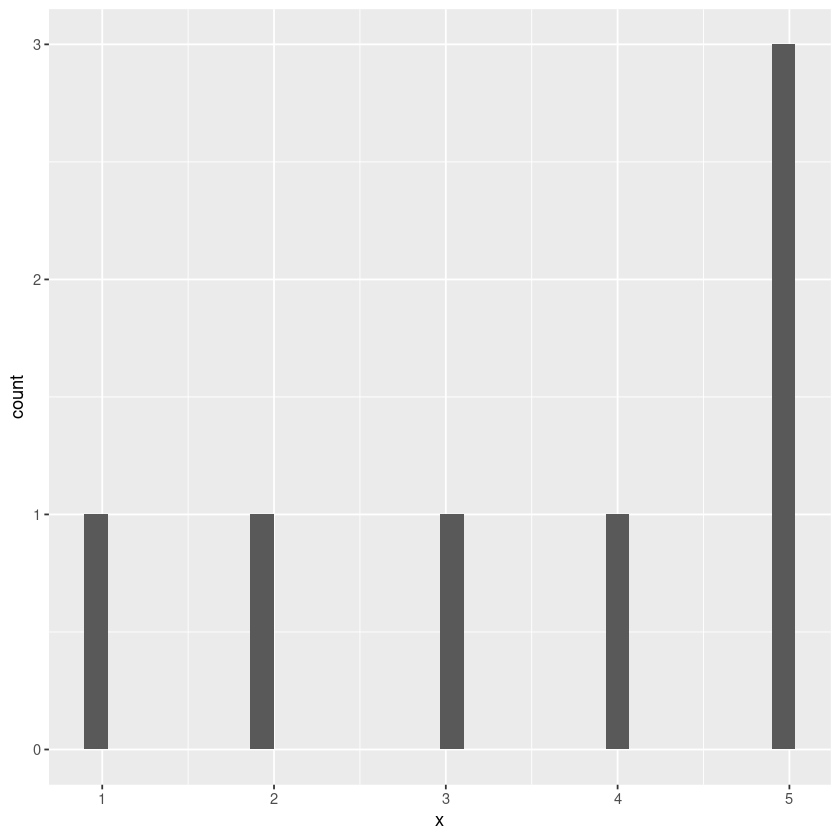
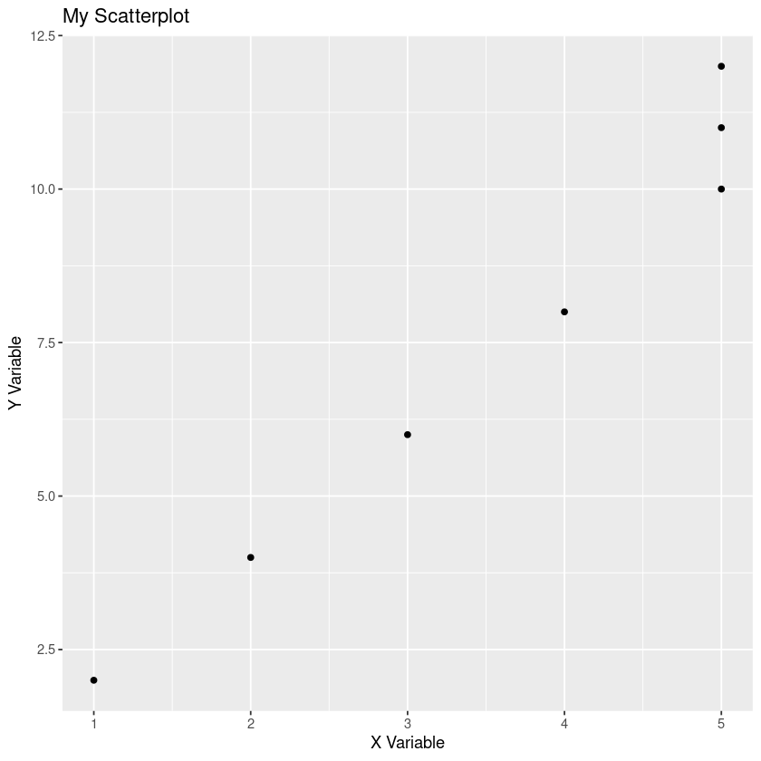
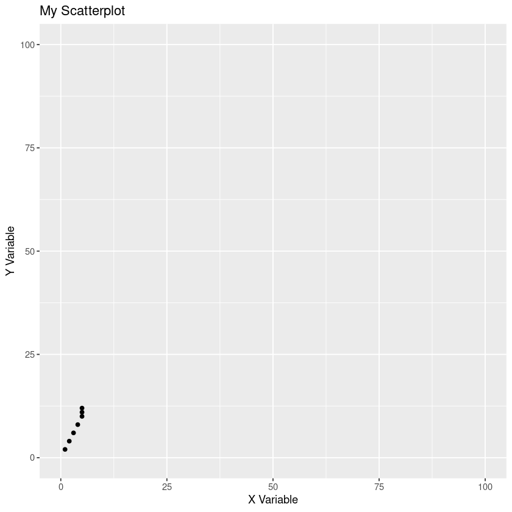

## data frame

```R
# Create a data frame with two columns and three rows
my_data <- data.frame(
  x = c(1, 2, 3),
  y = c(4, 5, 6)
)

# View the data frame
my_data
```

<table class="dataframe">
<caption>A data.frame: 3 × 2</caption>
<thead>
 <tr><th scope=col>x</th><th scope=col>y</th></tr>
 <tr><th scope=col>&lt;dbl&gt;</th><th scope=col>&lt;dbl&gt;</th></tr>
</thead>
<tbody>
 <tr><td>1</td><td>4</td></tr>
 <tr><td>2</td><td>5</td></tr>
 <tr><td>3</td><td>6</td></tr>
</tbody>
</table>

## ggplot

syntax

```r
ggplot(dataframe, aes(x = col-of-dataframe, y = col-of-dataframe)) + plottype()
```

plottypes are

- `geom_point()` scatter graph
- `geom_line()` line
- `geom_bar()` - bar - need one axis only, frequency on other
- `geom_histogram()` - histogram - need one axis only, frequency on other

```R
library(ggplot2)
```

```R
df <- data.frame(
    x = c(1,2,3,4,5,5,5),
    y = c(2,4,6,8,10,11,12)
)
df
```

<table class="dataframe">
<caption>A data.frame: 7 × 2</caption>
<thead>
 <tr><th scope=col>x</th><th scope=col>y</th></tr>
 <tr><th scope=col>&lt;dbl&gt;</th><th scope=col>&lt;dbl&gt;</th></tr>
</thead>
<tbody>
 <tr><td>1</td><td> 2</td></tr>
 <tr><td>2</td><td> 4</td></tr>
 <tr><td>3</td><td> 6</td></tr>
 <tr><td>4</td><td> 8</td></tr>
 <tr><td>5</td><td>10</td></tr>
 <tr><td>5</td><td>11</td></tr>
 <tr><td>5</td><td>12</td></tr>
</tbody>
</table>

# Scatter plot

- use `geom_point()`

```R
ggplot(df, aes(x = x, y = y)) + geom_point()
```



```R
ggplot(df, aes(x = x, y = y)) + geom_line()
```



```R
ggplot(df, aes(x = x)) + geom_bar()
```



```R
ggplot(df, aes(x = x)) + geom_histogram()
```

```output
`stat_bin()` using `bins = 30`. Pick better value with `binwidth`.
```



### more customizations

```R
ggplot(df, aes(x = x, y = y)) + geom_point() + labs(title = "My Scatterplot", x = "X Variable", y = "Y Variable")
```



```R
ggplot(df, aes(x = x, y = y)) + 
    geom_point() + 
    labs(title = "My Scatterplot", x = "X Variable", y = "Y Variable") +
    scale_x_continuous(limits = c(0, 100)) +
    scale_y_continuous(limits = c(0, 100))
```



```R

```
